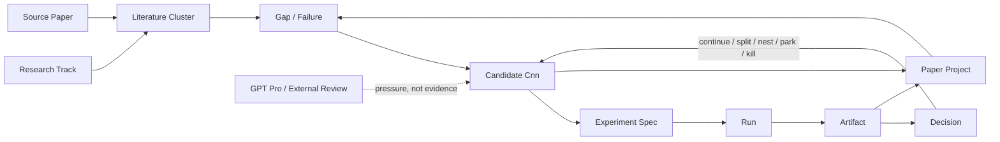

# Auto Research OS — Requirements Baseline (v1)

冻结日期：2026-08-04
状态：需求基线 v1.1。术语以 [CONTEXT.md](CONTEXT.md) 为准；本文件定义目标、领域模型、生命周期、对象字段、界面、进度度量、事实源与优先级。来源冲突按 [SOURCE_AUTHORITY.yaml](SOURCE_AUTHORITY.yaml) 处理；2026-08-04 外部审查的本地决定见 [review/AUTO_RESEARCH_OS_SOP_VERDICT_20260804.md](review/AUTO_RESEARCH_OS_SOP_VERDICT_20260804.md)。
范围：本轮为**只读需求审计 + 固化**，未改任何数据层或页面。下一步先重构数据层，页面视觉排在数据层之后。

> 一句话：不是"论文列表 + Idea 看板 + 实验看板"的拼盘，而是**以 Candidate 为核心、以 Evidence 为进度、以 Decision 为驱动、汇聚到多个 Paper Project 的研究操作系统**。看板只是这套系统的可视化投影。

## 0. North Star 与直接运营指标

> 在 Leader 默认只处理 3–5 个注意项、且证据边界不被弱化的前提下，缩短从不确定研究问题到可审计的新证据、明确研究决策和可组合论文证据脊柱的时间。

多篇论文是最终产出（lagging outcome），不是系统直接优化的活动指标。MVP 优先观察：

- `Time to first evidence-backed decision`：Candidate 达到 Problem Defined 后，到第一次有可审计依据的 Continue / Split / Nest / Park / Kill；
- `Decision-bearing evidence yield`：新增 admissible evidence 中，真正改变 Claim、lineage、paper lineage 或下一 Experiment Spec 的比例；
- depth event，而不是 Candidate / Source / 文档数量。固定每 Track 新增候选配额只可作 `explore` 模式下的 brainstorm heuristic。

## 1. 目标层级

**主目标 · 持续产出多篇论文**：六条 Track 并行保持可解释的信息流，并可按 `explore / validate / maintain / parked` 切换，不强制同深度或持续 Split。它们产出独立 Candidate / Benchmark / Method / Dataset / Diagnosis / Systems·HCI / 最终 Paper Project。节奏：1–3 天一次 cheap 验证，1–2 周一个新判断/分支/结果；多线并行、不均分资源；一个 Candidate 被 Kill 不影响该 Track 继续生长。

**次目标 · Auto Research SOP**：沉淀可复用 Reusable Asset（检索/审计方法、problem discovery、idea 生成筛选 Prompt、benchmark/evaluator、实验脚手架、数据工具、GPT Pro 审稿+本地 verdict、失败路径与 kill 原因、GPU/HDFS/SSH/云盘 SOP）。跨论文复用，但不强制共用一套代码。

**可选目标 · 产品/UbiComp**：手表/IMU/AR/语音/触觉/Ambient 等小产品。仅当产生新 sensing·interaction 问题 / 新数据集 / 可泛化 benchmark / 新方法 / field study 时才回流主线；否则属产品原型，不与顶会主线混在同一 Pipeline。

## 2. 领域模型与关系

对象与 ID 见 [CONTEXT.md](CONTEXT.md)。关系（DAG）：



不变式：
- Candidate 是核心工作单位；Proposal 只是其厚卡详情，不是独立对象。
- Experiment 是设计（Spec），Run 才是执行；一 Candidate 多 Spec，一 Spec 多 Run。
- 一篇 Paper Project 组合多个 Candidate；Candidate 可跨 Track 组合，但只选一个 primary track 归档。
- 失败结果、Negative Result、Kill Decision 必须保留可检索。
- External Review 是 pressure，不是 evidence。

## 3. 主生命周期（唯一主链；其余信息只能作标签，不得都变成看板列）

```text
Source / Failure → Paper Radar → Overlap & Evaluation Audit → Problem Definition
→ Cheap Probe Spec → Executable Experiment → Run → Evidence Review
→ Continue / Split / Nest / Park / Kill → Pilot / Training / Confirmation
→ Evidence Freeze → Paper Project → Internal Review / Submission / Revision / Publish
```

当前实际位置：主要停在 `Paper Radar → Problem Definition → Cheap Probe Spec`；**尚未真正进入 `Run → Local Result → Evidence Decision`**（0 Actual Run）。

五个正交维度（见 CONTEXT.md）：研究成熟度 / 证据等级 / 工作状态 / 决策结果 / 产出形态。资源约束（GPU/许可/云盘）属 Experiment，不是研究分类。

## 4. 各对象最小字段

**Candidate / Proposal**：真实 Failure；受害者与代价；一句可证伪 Claim；最近相关工作；novelty 最大威胁；评测单位；no-action + alternative-action counterfactual；killer baseline；1–3 天 cheap probe；Continue/Split/Kill 各自条件；下一条所需证据；当前 blocker 与解锁条件。

**Experiment Spec**：检验哪个 Candidate；独立变量；held-constant；数据及 snapshot；baseline 与 oracle；主指标与错误切片；stop rule；资源上限；计划 Run；可能产生的决策。

**Run**（真正执行才建）：commit + dirty diff；data/split digest；model/prompt/参数；实际 CPU/GPU/内存；SSH/pool/job/mount 验收；exit code + wall time；输出 URI + artifact digest；结果语义 `positive/negative/mixed/failed/invalid/inconclusive`。

**Paper Project**（当前最缺的对象）：标题与中心问题；论文形态；目标会议候选；组合了哪些 Candidate；每条 contribution 依赖哪些 Artifact；related-work pressure；缺的关键证据；主要图表；当前是 Paper Opportunity 还是正式 Paper Project；为什么现在能/不能开始写。**Candidate 通过有效 Cheap Probe 前只显示 Paper Opportunity，不建 Draft。**

## 5. 浏览器的核心产品合同

浏览器 HTML 不是研究数据库的漂亮外壳，而是用户的**异步 Research Control Plane**。它必须让用户在不重新打开多个 Codex 线程、不逐个询问论文与 Candidate 的情况下恢复全局认知。

首页首先生成一份 Leader Brief，而不是先展示统计：

- `What changed`：自上次查看后哪些研究判断真正变化；
- `Why it matters`：变化为什么影响研究组合、评测或论文机会；
- `Evidence`：它来自 Source Paper、Inference、External Review 还是 Local Result；
- `Attention`：现在最值得关注的 3–5 个对象，以及为什么不是其余对象；
- `Decision needed`：哪些事项需要用户决定，哪些 Agent 可继续自主推进；
- `Next evidence`：下一轮会产生什么可验收证据；
- `Paper outlook`：最接近形成哪些 Paper Opportunity / Paper Project，还缺什么。

认知负载约束：默认只显示 3–5 条解释性结论；完整论文、Candidate、Experiment 与 Run 按需下钻；论文优先按 Cluster 压缩；同类更新合并成 narrative；数字必须解释含义；同时展示“现在不需要关注什么”。每条宏观结论必须能回溯到 Candidate、Decision 或 Evidence。

## 6. 六个工作界面（取代当前五个平级 Tab）

1. **Now / Portfolio**（首页，30 秒答）：六线是否都在生长；哪些 Candidate 在往深走；当前 5–8 个真正 Active 对象；最近产生了什么证据/决策；哪些被数据/overlap/evaluator/GPU 卡住；下一步最值三件事；几篇 Paper Opportunity、离 Paper Project 缺什么。**首页不展示全部 36 张卡详情。**
2. **Research Map**：`Track → Cluster → Source Papers → 已覆盖评测 → 未覆盖 Gap → Candidate`。每篇 Source Paper 展示链接/venue·year/支持什么/不能声称什么/属哪些 Cluster/威胁哪些 Candidate/启发哪些 Candidate。图谱是导航，聚类和表格是主阅读。
3. **Candidate Workspace**（非 Proposal Workspace）：进 C01 一页看全 Proposal 正文、来源论文、novelty overlap、状态与证据等级、演变历史、Split/Nest/Merge 关系、Experiment Specs、Runs 与 Artifacts、最近 Decision、下一步与 kill rule、可能组合到哪些 Paper Project。
4. **Experiment Center**（严格分区）：Planned Specs / Executable / Running / Analyzing / Decided / Failed·Invalid·Archived。无 README 不显示为正式 Experiment；无 Run Manifest 不显示 Running；无 Artifact 不显示 Local Result。
5. **Paper Portfolio**：区分 Paper Opportunity（叙事有、证据不足）与 Paper Project（≥1 存活 Claim + 本地证据）。回答"正在形成什么论文"，不是"读过什么论文"。
6. **Library / Archive**（次级入口）：evaluator/dataset/prompt/tool/harness/GPU·HDFS SOP/GPT Pro reviews/negative results/killed candidates/product prototypes。

## 7. 用户–Agent 协作 SOP

聊天线程是执行空间，不是长期事实源。一次会改变研究判断的交互结束后，Agent 必须执行 Settlement：记录 scope、changed、why it matters、evidence level/pointer、decision 或待决策、next evidence、blocker/unlock condition。Dashboard 只消费 Settlement 与 canonical 资产，不读取聊天原文。

```text
用户给出 Program / Track / Candidate 级目标
→ Agent 读取 canonical 资产并研究
→ 产生 Source / Proposal / Experiment / Run / Review 增量
→ Settlement 回写 Evidence、影响、Decision、Next、Blocker
→ Dashboard 压缩为 Leader Brief 并提供下钻
→ 用户只处理高影响研究决策
```

用户不需要为每个子问题创建独立线程。Agent 可以在多个执行线程中工作，但必须写回同一套稳定 ID。事实记录、运行状态和 blocker 可由 Agent 自主维护；Kill / Split / Merge / 激活 Paper Project 等高影响决定必须对用户可见且可追溯。GPT Pro 输出先成为 External Review，只有经过本地 verdict 才能改变 Candidate。

## 8. 进度度量（只显示这些，不用文档数/卡片数/百分比）

本周期新增 Candidate 数；通过 Overlap Audit 的数；新增可执行 Experiment 数；有效 Run 数；Continue/Split/Nest/Park/Kill 数；Candidate→首次 Decision 的时间；连续多久无新增证据；六线是否有"饿死方向"（无 Active Candidate）；Paper Project 已覆盖的 Claim/Evidence 数；Blocker 是否有解锁条件。

进度表达示例（取代"离论文 70%"）：
```text
3 个核心 Claim
├── 2 个已有 Local Result
├── 1 个仍是 Inference
├── 1 张主表缺 Confirmation
└── 2 个 Novelty Threat 未解决
```

## 9. 当前实现状态（2026-08-04 重构后）

已关闭的根因：

1. `research-index.yaml` 已接管稳定 ID、关系、五维状态、时间戳和指针；Dashboard 不再手工维护第二份研究事实。
2. 结构化索引包含 **106 Source ledger 入口、32 Literature Cluster、36 Candidate 节点、11 Experiment Spec**。
3. 所有视图统一派生 **34 独立 Candidate + 2 Nested Slice + 5 Probe Ready + 0 Actual Run + 0 Local Result**。
4. `Experiment Spec / Run / Artifact / Local Result`、`Source Paper / Paper Thread`、`Candidate / Proposal view` 已分离。
5. 浏览器已重构为 `Now / Research Map / Candidates / Experiments / Decisions / Paper Portfolio / Assets` 七个因果下钻工作区。
6. Leader Brief 采用确定性选择和 3–5 条注意力上限；External Review、Spec 和 Source Paper 结果不会显示成本地证据。
7. `research-events.jsonl` 已承接 append-only applied transition，Nest 决策可恢复。
8. `settle-research-event.mjs` 已提供 stable-ID typed changes、optimistic locking、两文件 journal、证据边界校验与中断恢复；Dashboard sync 会拒绝读取写入中或待恢复状态。

仍未关闭的基础设施：

- 106 个 ledger 来源中仍有一部分等待完整 Cluster / assertion-level Candidate linkage；页面会诚实显示未链接数量；
- 尚未执行第一条真实 Cheap Probe，因此 Run / Artifact / Local Result / Paper Thread 仍为 0。

## 10. 数据层组织（文件少、边界清）

- `PROGRAM_MAP.md`：长期研究定义
- `LITERATURE_MAP.md`：论文簇与研究压力
- `PROBLEM_BACKLOG.md`：Candidate 完整定义
- **`research-index.yaml`（新增）**：只存 ID、关系、五维状态、时间戳、指针（唯一结构化事实源）
- `experiments/<id>/`：真实开始才建
- `runs/<id>/manifest.yaml`：真正执行才建
- `CURRENT.md`：由结构化索引生成，或作轻量人工摘要
- `dashboard/`：**只读**结构化索引 + Markdown，不再手写研究事实

更新一张 Candidate → Portfolio / Research Map / Experiment Center / Paper Portfolio 自动同步。

## 11. 优先级

**P0 · 先把系统事实做对（✅ 已完成）**：冻结术语；稳定 ID 与关系；36 节点 / 34 独立 Candidate；`research-index.yaml`；Spec / Run；Source Paper / Paper Thread；自动汇总；明确 0 Actual Run；原子 writer 与 optimistic locking。

**P1 · 可工作的研究界面（✅ 已完成）**：Now/Portfolio、Research Map、Candidate Workspace、Experiment Center、Decision/Evolution、Paper Opportunity/Project、Assets。

**P2 · 效率与体验（进行中）**：GPT Pro Project 自动同步与陈旧提醒；从论文半自动生成 Cluster/Candidate 草稿；Run Manifest 自动采集；Artifact/图表自动挂接；本地服务持久启动；托管访问。

## 12. 验收标准

1. 首页 30 秒判断研究是否在动、哪里深入、哪里阻塞。
2. 能从任意 Source Paper 追到 Cluster、Gap、Candidate。
3. 能从 Candidate 追到 Experiment、Run、Artifact、Decision、Paper Project。
4. 所有数量自动计算，不手写。
5. Nested Slice 不计入独立 Candidate（34）。
6. 无 Run Manifest 不显示 Running。
7. 无有效 Artifact 不显示 Local Result。
8. GPT Pro 意见不显示成论文证据。
9. 失败、Negative Result、Kill 可检索可复用。
10. 更新一次事实，不需多页重复修改。
11. 管理 Candidate 的成本显著低于做实验的成本。
12. 实际 Run 为 0 时，系统诚实显示 0，不用设计卡填满实验看板。
13. 不读取任何历史聊天，首页仍能解释自上次查看以来的关键变化、意义、证据与下一步。
14. 首页默认只要求用户理解 3–5 个注意项；完整细节通过稳定链接下钻。
15. 新开或关闭 Codex 线程不改变 canonical 状态，也不使研究上下文丢失。
