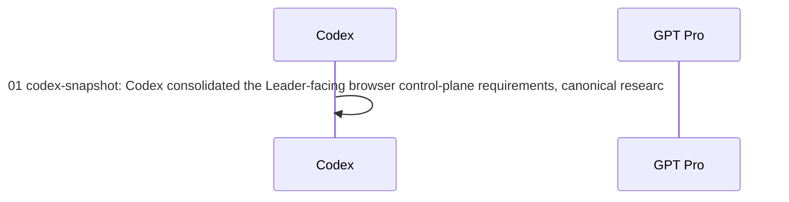

# GPT Pro Evidence Bundle

## Metadata
- Generated: 2026-08-04T15:29:57+08:00
- Repository label: `memory-proactive-agent-research`
- Mode: `general_question`
- Repository context: `explicit`
- Auto dependency closure: `not-applicable`
- Bridge thread id: `auto-research-20260804-review-and-optimize-the-auto-research-os-l`
- Bridge project id: `auto-research`
- Codex session id: `auto-research-20260804-review-and-optimize-the-auto-research-os-l-codex`
- Git branch: `main`
- Git commit: `dd9f8a7`

## User Goal
Stress-test and optimize the Leader-facing Auto Research OS and human-agent Settlement SOP for high-frequency multi-paper research.

## Question for GPT Pro
What should be kept, simplified, added, or deferred, and what implementable MVP object model, user journey, information architecture, state machine, metrics, acceptance criteria, and phased roadmap should Codex adopt?

## Evidence Contract
Treat this package as partial evidence. Do not assume access to unlisted files. Separate observed facts from inference and state missing evidence explicitly.

### Codex notes
- `context/codex-session-notes.md`

### Thread context
- `context/bridge-thread-context.md`

### Project context
- `context/bridge-project-context.md`

### Repository files
- `source/CONTEXT.md` — explicit include
- `source/REQUIREMENTS_AUTO_RESEARCH_OS.md` — explicit include
- `source/OPERATIONS.md` — explicit include
- `source/operations/KANBAN_REQUIREMENTS.md` — explicit include
- `source/README.md` — explicit include
- `source/PROGRAM_MAP.md` — explicit include
- `source/CURRENT.md` — explicit include
- `source/PROBLEM_BACKLOG.md` — explicit include
- `source/PROJECT_BRIEF.md` — explicit include
- `source/operations/ASSET_PROTOCOL.md` — explicit include

Files not listed above were not supplied. Secret/env files, credentials, cookies, private keys, databases, raw data, vendor trees, and large artifacts are excluded by policy.

## Git Status
```txt
 M OPERATIONS.md
 M README.md
 M operations/KANBAN_REQUIREMENTS.md
?? CONTEXT.md
?? REQUIREMENTS_AUTO_RESEARCH_OS.md
?? artifacts/auto-research-os-sop-review-20260804-prompt.md
```

## Git Diff Stat
```txt
 OPERATIONS.md                     | 27 +++++++++++++++++++++++
 README.md                         |  5 ++++-
 operations/KANBAN_REQUIREMENTS.md | 46 +++++++++++++++++++++++++++++++++++++++
 3 files changed, 77 insertions(+), 1 deletion(-)
```

## Supplied Source Files

### `CONTEXT.md`
```markdown
# Auto Research OS — Context (Ubiquitous Language)

本文件是本项目的**唯一术语词典**。数据层、`CURRENT.md`、`research-idea-forest-site` 及任何看板都必须使用这里的词义；冲突以本文件为准。

> 一句话定位：这是一套**以 Candidate 为核心、以 Evidence 为进度、以 Decision 为驱动、最终汇聚到多个 Paper Project 的研究操作系统**——不是"论文列表 + Idea 看板 + 实验看板"的拼盘。

冻结日期：2026-08-04

## Language

### 核心对象

**Research Program**：
整个项目研究的上位对象（变化环境中的长期 Agent）。全局唯一，ID `PROGRAM`。

**Track**：
六条研究索引线之一（M-AI / M-PHY / P-AI / P-PHY / U-AI / U-PHY）。是**资产归档索引**，不是学术 ontology。
_Avoid_: Branch（"branch" 一词保留给分叉动作，见 Split）、方向（口语可用，实体名用 Track）。

**Source Paper**：
外部的相关论文——引用、benchmark 来源、related work。ID `SRC-nnn`。它提供 `direct coverage` 或 `pressure`，**本身不是本项目的证据**。
_Avoid_: Paper（裸词禁用，必与 Paper Project 混淆）、文献。

**Literature Cluster**：
一组 Source Paper 共同解决的问题簇。ID 如 `MA-03`。
_Avoid_: 论文组。

**Gap / Failure**：
现有评测/方法看不到的失败或空白。ID `GAP-nnn`。是 Candidate 的来源。

**Candidate**：
**系统的核心研究工作单位** = 一个可证伪 Claim + 它的评测。ID `Cnn`（C01–C36）。"Idea" 只是口语，系统实体一律叫 Candidate。
_Avoid_: Idea（口语可用，实体名禁用）、Proposal（那是 Candidate 的详情，见下）、题目。

**Proposal**：
Candidate 的**完整厚卡详情**（动机、Claim、novelty、评测设计、probe、kill rule…）。它是 Candidate 的一个视图，**不单独编号、不是独立对象**。
_Avoid_: 把 Proposal 当独立工作项。

**Experiment Spec**：
检验某 Candidate 的实验**设计**（独立变量、baseline、oracle、stop rule…）。ID `E-Cnn-mm`。一个 Candidate 可有多个 Experiment Spec。
_Avoid_: Experiment（裸词禁用，必分 Spec 与 Run）。

**Run**：
Experiment Spec 的一次**真实执行**。ID `R-E-Cnn-mm-nnn`。只有真正执行才创建。一个 Spec 可有多个 Run。
_Avoid_: 把"实验想法"或"实验设计"叫 Run。

**Artifact**：
Run 产出的不可变证据。以 digest / URI 标识。

**Local Result**：
**只有有效 Run 产生的 Artifact** 才算 Local Result。文献结论、GPT Pro 判断都不是。
_Avoid_: Result（裸词禁用）、把外部结论当结果。

**Decision**：
对 Candidate 的研究决策。ID `D-nnn`。取值见"决策结果"枚举。

**Paper Project**：
本项目**准备产出的一篇论文**，组合多个 Candidate 的存活 Claim + 本地证据。ID `PP-nnn`。
_Avoid_: Paper、Draft。**在 Candidate 通过一次有效 Cheap Probe 前，只存在 Paper Opportunity，不创建 Paper Project。**

**Paper Opportunity**：
有潜在论文叙事、但证据不足的前置状态。不编号为 PP，成熟后才升级为 Paper Project。

**Reusable Asset**：
跨论文可复用的工具/数据/Prompt/evaluator/SOP。ID `A-nnn`。

**External Review**：
GPT Pro 或其他外部评审提出的**压力（pressure），不是证据（evidence）**。ID `REV-nnn`。

### 动作

**Split**：
一个 Candidate 分叉出新的 Candidate（母卡关闭、开子卡）。
_Avoid_: Branch（保留给 Track 无关；分叉动作只叫 Split）。

**Nest**：
一个 Candidate 降级为另一个 Candidate 的 evaluator slice，保留编号供追溯，但**不计入独立 Candidate 数**。例：C14→C13、C15→C13/C03。

**Merge**：两个 Candidate 合并为一。
**Park**：搁置，须写解锁条件。
**Kill**：终止，须写原因；Kill 后仍保留可检索。
**Continue**：有稳定 failure/headroom，继续。

### 五个正交维度（Candidate 不能只有一个 status）

**研究成熟度**：Radar → Audit → Problem → Probe → Pilot → Confirmation → Paper。
**证据等级**：`Unverified Lead` < `Source Supported` < `Inference` < `Local Result`。
**工作状态**：Active / Blocked / Parked / Closed。
**决策结果**：Continue / Split / Nest / Merge / Park / Kill。
**产出形态**：Method / Benchmark / Evaluation / Dataset / Diagnosis / Systems / HCI。

GPU、数据许可、云盘等是 **Experiment 的资源约束**，不是研究分类维度。

### 计数口径（冻结）

- **总节点 = 36**（C01–C36 全部）。
- **独立 Candidate = 34**（扣除已 Nest 的 C14、C15）。看板与进度指标默认用 34；"独立 Candidate" 一词专指未 Nest 的。
- 计数变化规则：Split +N、Nest 独立数 −1（保留编号）、Merge −1、narrow 不变号。

### 进度语义

**Progress**：
只按**新增证据**与**研究决策**计算。文档数量、卡片移动、完成百分比都不算进度。
_Avoid_: "离论文 70%" 这类无可靠含义的百分比。

```

### `REQUIREMENTS_AUTO_RESEARCH_OS.md`
```markdown
# Auto Research OS — Requirements Baseline (v1)

冻结日期：2026-08-04
状态：需求基线 v1。术语以 [CONTEXT.md](CONTEXT.md) 为准；本文件定义目标、领域模型、生命周期、对象字段、界面、进度度量、事实源与优先级。
范围：本轮为**只读需求审计 + 固化**，未改任何数据层或页面。下一步先重构数据层，页面视觉排在数据层之后。

> 一句话：不是"论文列表 + Idea 看板 + 实验看板"的拼盘，而是**以 Candidate 为核心、以 Evidence 为进度、以 Decision 为驱动、汇聚到多个 Paper Project 的研究操作系统**。看板只是这套系统的可视化投影。

## 1. 目标层级

**主目标 · 持续产出多篇论文**：六条 Track 并行、各自不断 Split，产出独立 Candidate / Benchmark / Method / Dataset / Diagnosis / Systems·HCI / 最终 Paper Project。节奏：1–3 天一次 cheap 验证，1–2 周一个新判断/分支/结果；多线并行、不均分资源；一个 Candidate 被 Kill 不影响该 Track 继续生长。

**次目标 · Auto Research SOP**：沉淀可复用 Reusable Asset（检索/审计方法、problem discovery、idea 生成筛选 Prompt、benchmark/evaluator、实验脚手架、数据工具、GPT Pro 审稿+本地 verdict、失败路径与 kill 原因、GPU/HDFS/SSH/云盘 SOP）。跨论文复用，但不强制共用一套代码。

**可选目标 · 产品/UbiComp**：手表/IMU/AR/语音/触觉/Ambient 等小产品。仅当产生新 sensing·interaction 问题 / 新数据集 / 可泛化 benchmark / 新方法 / field study 时才回流主线；否则属产品原型，不与顶会主线混在同一 Pipeline。

## 2. 领域模型与关系

对象与 ID 见 [CONTEXT.md](CONTEXT.md)。关系（DAG）：

``​`mermaid
flowchart LR
    T["Research Track"] --> C["Literature Cluster"]
    S["Source Paper"] --> C
    C --> G["Gap / Failure"]
    G --> I["Candidate Cnn"]
    I --> E["Experiment Spec"]
    E --> R["Run"]
    R --> A["Artifact"]
    A --> D["Decision"]
    D -->|"continue / split / nest / park / kill"| I
    I --> P["Paper Project"]
    A --> P
    X["GPT Pro / External Review"] -. "pressure, not evidence" .-> I
    P --> G
``​`

不变式：
- Candidate 是核心工作单位；Proposal 只是其厚卡详情，不是独立对象。
- Experiment 是设计（Spec），Run 才是执行；一 Candidate 多 Spec，一 Spec 多 Run。
- 一篇 Paper Project 组合多个 Candidate；Candidate 可跨 Track 组合，但只选一个 primary track 归档。
- 失败结果、Negative Result、Kill Decision 必须保留可检索。
- External Review 是 pressure，不是 evidence。

## 3. 主生命周期（唯一主链；其余信息只能作标签，不得都变成看板列）

``​`text
Source / Failure → Paper Radar → Overlap & Evaluation Audit → Problem Definition
→ Cheap Probe Spec → Executable Experiment → Run → Evidence Review
→ Continue / Split / Nest / Park / Kill → Pilot / Training / Confirmation
→ Evidence Freeze → Paper Project → Internal Review / Submission / Revision / Publish
``​`

当前实际位置：主要停在 `Paper Radar → Problem Definition → Cheap Probe Spec`；**尚未真正进入 `Run → Local Result → Evidence Decision`**（0 Actual Run）。

五个正交维度（见 CONTEXT.md）：研究成熟度 / 证据等级 / 工作状态 / 决策结果 / 产出形态。资源约束（GPU/许可/云盘）属 Experiment，不是研究分类。

## 4. 各对象最小字段

**Candidate / Proposal**：真实 Failure；受害者与代价；一句可证伪 Claim；最近相关工作；novelty 最大威胁；评测单位；no-action + alternative-action counterfactual；killer baseline；1–3 天 cheap probe；Continue/Split/Kill 各自条件；下一条所需证据；当前 blocker 与解锁条件。

**Experiment Spec**：检验哪个 Candidate；独立变量；held-constant；数据及 snapshot；baseline 与 oracle；主指标与错误切片；stop rule；资源上限；计划 Run；可能产生的决策。

**Run**（真正执行才建）：commit + dirty diff；data/split digest；model/prompt/参数；实际 CPU/GPU/内存；SSH/pool/job/mount 验收；exit code + wall time；输出 URI + artifact digest；结果语义 `positive/negative/mixed/failed/invalid/inconclusive`。

**Paper Project**（当前最缺的对象）：标题与中心问题；论文形态；目标会议候选；组合了哪些 Candidate；每条 contribution 依赖哪些 Artifact；related-work pressure；缺的关键证据；主要图表；当前是 Paper Opportunity 还是正式 Paper Project；为什么现在能/不能开始写。**Candidate 通过有效 Cheap Probe 前只显示 Paper Opportunity，不建 Draft。**

## 5. 浏览器的核心产品合同

浏览器 HTML 不是研究数据库的漂亮外壳，而是用户的**异步 Research Control Plane**。它必须让用户在不重新打开多个 Codex 线程、不逐个询问论文与 Candidate 的情况下恢复全局认知。

首页首先生成一份 Leader Brief，而不是先展示统计：

- `What changed`：自上次查看后哪些研究判断真正变化；
- `Why it matters`：变化为什么影响研究组合、评测或论文机会；
- `Evidence`：它来自 Source Paper、Inference、External Review 还是 Local Result；
- `Attention`：现在最值得关注的 3–5 个对象，以及为什么不是其余对象；
- `Decision needed`：哪些事项需要用户决定，哪些 Agent 可继续自主推进；
- `Next evidence`：下一轮会产生什么可验收证据；
- `Paper outlook`：最接近形成哪些 Paper Opportunity / Paper Project，还缺什么。

认知负载约束：默认只显示 3–5 条解释性结论；完整论文、Candidate、Experiment 与 Run 按需下钻；论文优先按 Cluster 压缩；同类更新合并成 narrative；数字必须解释含义；同时展示“现在不需要关注什么”。每条宏观结论必须能回溯到 Candidate、Decision 或 Evidence。

## 6. 六个工作界面（取代当前五个平级 Tab）

1. **Now / Portfolio**（首页，30 秒答）：六线是否都在生长；哪些 Candidate 在往深走；当前 5–8 个真正 Active 对象；最近产生了什么证据/决策；哪些被数据/overlap/evaluator/GPU 卡住；下一步最值三件事；几篇 Paper Opportunity、离 Paper Project 缺什么。**首页不展示全部 36 张卡详情。**
2. **Research Map**：`Track → Cluster → Source Papers → 已覆盖评测 → 未覆盖 Gap → Candidate`。每篇 Source Paper 展示链接/venue·year/支持什么/不能声称什么/属哪些 Cluster/威胁哪些 Candidate/启发哪些 Candidate。图谱是导航，聚类和表格是主阅读。
3. **Candidate Workspace**（非 Proposal Workspace）：进 C01 一页看全 Proposal 正文、来源论文、novelty overlap、状态与证据等级、演变历史、Split/Nest/Merge 关系、Experiment Specs、Runs 与 Artifacts、最近 Decision、下一步与 kill rule、可能组合到哪些 Paper Project。
4. **Experiment Center**（严格分区）：Planned Specs / Executable / Running / Analyzing / Decided / Failed·Invalid·Archived。无 README 不显示为正式 Experiment；无 Run Manifest 不显示 Running；无 Artifact 不显示 Local Result。
5. **Paper Portfolio**：区分 Paper Opportunity（叙事有、证据不足）与 Paper Project（≥1 存活 Claim + 本地证据）。回答"正在形成什么论文"，不是"读过什么论文"。
6. **Library / Archive**（次级入口）：evaluator/dataset/prompt/tool/harness/GPU·HDFS SOP/GPT Pro reviews/negative results/killed candidates/product prototypes。

## 7. 用户–Agent 协作 SOP

聊天线程是执行空间，不是长期事实源。一次会改变研究判断的交互结束后，Agent 必须执行 Settlement：记录 scope、changed、why it matters、evidence level/pointer、decision 或待决策、next evidence、blocker/unlock condition。Dashboard 只消费 Settlement 与 canonical 资产，不读取聊天原文。

``​`text
用户给出 Program / Track / Candidate 级目标
→ Agent 读取 canonical 资产并研究
→ 产生 Source / Proposal / Experiment / Run / Review 增量
→ Settlement 回写 Evidence、影响、Decision、Next、Blocker
→ Dashboard 压缩为 Leader Brief 并提供下钻
→ 用户只处理高影响研究决策
``​`

用户不需要为每个子问题创建独立线程。Agent 可以在多个执行线程中工作，但必须写回同一套稳定 ID。事实记录、运行状态和 blocker 可由 Agent 自主维护；Kill / Split / Merge / 激活 Paper Project 等高影响决定必须对用户可见且可追溯。GPT Pro 输出先成为 External Review，只有经过本地 verdict 才能改变 Candidate。

## 8. 进度度量（只显示这些，不用文档数/卡片数/百分比）

本周期新增 Candidate 数；通过 Overlap Audit 的数；新增可执行 Experiment 数；有效 Run 数；Continue/Split/Nest/Park/Kill 数；Candidate→首次 Decision 的时间；连续多久无新增证据；六线是否有"饿死方向"（无 Active Candidate）；Paper Project 已覆盖的 Claim/Evidence 数；Blocker 是否有解锁条件。

进度表达示例（取代"离论文 70%"）：
``​`text
3 个核心 Claim
├── 2 个已有 Local Result
├── 1 个仍是 Inference
├── 1 张主表缺 Confirmation
└── 2 个 Novelty Threat 未解决
``​`

## 9. 当前实现问题（已对 research-idea-forest-site 核实）

事实源核对结果（`app/research-data.ts`, 725 行）：
1. ✅ 手工维护 **8 个 Proposal**（C01/C03/C08/C13/C23/C25/C28/C31），canonical 跟踪 36 节点。
2. ✅ 手工 **11 个 Experiment 对象**，但 canonical `experiments/` 真实文件 **0 个**。
3. ✅ **无 Paper Project 对象**（导出类型仅 Paper/Cluster/Branch/Proposal/Experiment）；只有 51 个 Source Paper。
4. Literature/Proposal/Experiment/Asset 做成五个平级空间，因果关系要用户脑补。
5. 汇总数字、最近活动、阶段状态**硬编码**，不随 canonical 变化。
6. C14/C15 已 Nest 却仍计入 36 独立 Candidate（应为 34）。
7. "最后决策日"部分是看板初始化日期，非真实事件时间，无法显示可靠速度。
8. UI 展示"实验准备度"，却不展示真正缺失的 evaluator/代码/快照/Run。
9. 仍用旧词 `Proposal` / `branch`（违反 CONTEXT.md）。

根因：不是 CSS/布局问题，是**数据模型与事实源**问题。

## 10. 数据层组织（文件少、边界清）

- `PROGRAM_MAP.md`：长期研究定义
- `LITERATURE_MAP.md`：论文簇与研究压力
- `PROBLEM_BACKLOG.md`：Candidate 完整定义
- **`research-index.yaml`（新增）**：只存 ID、关系、五维状态、时间戳、指针（唯一结构化事实源）
- `experiments/<id>/`：真实开始才建
- `runs/<id>/manifest.yaml`：真正执行才建
- `CURRENT.md`：由结构化索引生成，或作轻量人工摘要
- Dashboard（site 仓）：**只读**结构化索引 + Markdown，不再手写研究事实

更新一张 Candidate → Portfolio / Research Map / Experiment Center / Paper Portfolio 自动同步。

## 11. 优先级

**P0 · 先把系统事实做对**：冻结术语（✅ CONTEXT.md）；定义稳定 ID 与关系（✅ 本文件 §2）；修正 36 节点 / 34 独立 Candidate 口径；建 `research-index.yaml`；分 Experiment Spec 与 Run；分 Source Paper 与 Paper Project；所有汇总自动计算；明确 0 Actual Run。

**P1 · 可工作的研究界面**：Now/Portfolio、Research Map、Candidate Workspace、Experiment Center、Decision/Evolution DAG、Paper Opportunity/Project。

**P2 · 效率与体验**：GPT Pro Project 自动同步与陈旧提醒；从论文半自动生成 Cluster/Candidate 草稿；Run Manifest 自动采集；Artifact/图表自动挂接；本地服务持久启动；搜索/过滤/跨对象跳转；托管访问。

## 12. 验收标准

1. 首页 30 秒判断研究是否在动、哪里深入、哪里阻塞。
2. 能从任意 Source Paper 追到 Cluster、Gap、Candidate。
3. 能从 Candidate 追到 Experiment、Run、Artifact、Decision、Paper Project。
4. 所有数量自动计算，不手写。
5. Nested Slice 不计入独立 Candidate（34）。
6. 无 Run Manifest 不显示 Running。
7. 无有效 Artifact 不显示 Local Result。
8. GPT Pro 意见不显示成论文证据。
9. 失败、Negative Result、Kill 可检索可复用。
10. 更新一次事实，不需多页重复修改。
11. 管理 Candidate 的成本显著低于做实验的成本。
12. 实际 Run 为 0 时，系统诚实显示 0，不用设计卡填满实验看板。
13. 不读取任何历史聊天，首页仍能解释自上次查看以来的关键变化、意义、证据与下一步。
14. 首页默认只要求用户理解 3–5 个注意项；完整细节通过稳定链接下钻。
15. 新开或关闭 Codex 线程不改变 canonical 状态，也不使研究上下文丢失。

```

### `OPERATIONS.md`
```markdown
# Minimal Auto Research Operating System

更新日期：2026-07-30  
当前模式：高吞吐问题发现；暂不设置 Draft gate

目标是让 idea 生成足够激进，同时让每个研究判断都能被追溯、快速证伪和安全复用。管理系统不能比研究本身更重。

## 1. 两层资产流

### 发现层

``​`text
Source / Real Failure
  → Paper Radar
  → Eval Landscape
  → White-space Inbox
  → Problem Definition
  → Cheap Probe
  → Continue / Branch / Park / Kill
``​`

### 执行层

``​`text
Problem → Experiment → Run → Artifact → Decision
``​`

| 资产 | 负责回答 | 最小内容 |
| --- | --- | --- |
| Source | 原始证据是什么 | URL/version、核验范围、不可扩大解释的边界 |
| Idea/Problem | 为什么值得测 | failure、claim、counterfactual、killer baseline、kill rule |
| Experiment | 要操纵什么 | independent variable、held constants、metric、resource ceiling |
| Run | 实际执行了什么 | commit、data digest、model/prompt、actual resource、time、output |
| Artifact | 证据在哪里 | immutable URI、digest、format |
| Decision | 下一步是什么 | evidence pointer、continue/branch/park/kill |

当前不维护 Draft、论文结构或 claim-evidence 写作表。等问题通过 cheap probe、真正进入成稿期后再创建，不能用“开始写了”替代问题成立。

### 统一最小评测样例

所有 idea 的评测切片共享同一最小 schema（迁自执行看板，作为稳定规范固定在此）。每个候选按自身 failure family 只填相关字段，不要求填满：

``​`yaml
latent_state: {}
observations:
  available: []
  missing: []
  provenance: []
history:
  events: []
  updates: []
  revocations: []
available_information_actions: [retrieve, ask, verify, sense, wait]
available_intervention_actions: [silence, suggest, prepare, execute, withdraw, correct]
counterfactuals:
  no_action_outcome:
  alternative_action_outcomes:
cost_vector:
  miss:
  false_alarm:
  delay:
  interruption:
  privacy:
  authority:
  compute:
  repair:
attribution_labels:
  writer:
  memory:
  retrieval:
  reasoning:
  policy:
  tool:
  interface:
``​`

## 2. 文件边界

- `PROGRAM_MAP.md`：长期范围、3×2 资产索引和开放式评测轴；
- `LITERATURE_MAP.md`：论文簇、共同评测假设、coverage pressure 与 Idea Forest；
- `PROBLEM_BACKLOG.md`：问题定义、候选 atlas、证据边界和初始路由的 source of truth；
- `CURRENT.md`：card 实时 column、next action、blocker、当前 probe 队列和停止条件的唯一动态看板；
- `OPERATIONS.md`：资产、实验、运行与数据规则；
- `GPT_PRO_REVIEW.md`：外部模型原始建议的本地采纳/修改/拒绝；
- `sources/*ledger.md`：已经打开核验的原始论文、benchmark 与精确证据范围；
- `experiments/<id>/README.md`：真实开始后才创建的冻结实验设计；
- `experiments/<id>/runs/<run-id>/manifest.yaml`：一次执行的事实与结果指针。

不为每个 brainstorm、候选、论文或标签单独建文件。长版外部回答保存在 Bridge 审计目录，主文档只保留可执行索引。

## 3. 狂暴 idea 生成纪律

允许高数量，不允许低区分度：

1. 每个分支维护至少 6 个不同 failure family；
2. 每周每分支至少补充 3 个新候选；
3. 候选优先来自论文 limitation、benchmark 不可观察空间、指标代理错位和真实 failure；
4. 每个候选必须指出受害者/代价、评测单位、一个非默认动作和 no-action/alternative-action counterfactual；
5. 相同 `use/abstain/ask gate` 换领域名，不算新 idea；
6. 一周内无法形成 1–3 天 probe 的候选，必须写明数据/许可/ground-truth 解锁条件；
7. 每周至少 kill 或 branch 一个节点，防止只积累漂亮叙事。

候选数量没有硬上限；进入 `Problem Definition` 与 `Cheap Probe` 的 WIP 各不超过 6，以保证快速产生决策。

## 4. 快速验证阶梯

| Rung | 目标 | 默认规模 | 默认资源 | 升级门 |
| --- | --- | --- | --- | --- |
| -1 Paper/Eval audit | 找到真实 coverage 与不可观察空间 | 论文、代码、数据卡、benchmark protocol | CPU | 能写出 falsifiable failure，不夸大 novelty |
| 0 Problem definition | 冻结评测对象 | claim、unit、counterfactual、core table、kill rule | CPU | 有 1–3 天 probe 与 killer baseline |
| 1 Cheap probe | 判断 failure/headroom 是否存在 | 50–300 cases、oracle、强简单 baseline | CPU/API/最多 1 GPU | 证据能改变 continue/branch/park/kill |
| 2 Pilot | 验证泛化与关键消融 | 200–1,000 examples、2–3 seeds | 1–2×80G 或等价 API | 差异不是 token/call/model-size 造成 |
| 3 Light training | 只训练必要模块 | small gate/head 或 7B/8B LoRA | 2×A100/A800 80G | 方法变量独立成立 |
| 4 Confirmation | 主表与审稿压力测试 | full benchmark、≥3 seeds、≥2 model families | 2–4×80G | claim 与 evidence scope 已冻结 |

当前主要工作停留在 Rung -1 到 Rung 1。8 卡、32B、长序列 RL、大规模 wearable pretraining 和完整产品部署不是当前关键路径。

## 5. 1–2 周爆发循环

不强制按星期排程，每个候选独立跑：

``​`text
0–0.5 天  source/benchmark 核验 + killer baseline
0.5–1 天  evaluator / generator / oracle
1–3 天    cheap probe + error slices
立即       continue / branch / park / kill
``​`

一条线在等数据或 GPU 时，立刻回到 Paper Radar 扩散，不空等。六个分支都持续有信息增量，但不要求同一深度，也不按分支平均分 GPU。

## 6. 实验与运行规则

- Experiment design 与 Run execution 分离；
- 每次运行使用新的 `run_id`，原始输出不可覆盖；
- 一次实验只改变一个主要因素：data、prompt/policy、model size、optimization、memory representation 或 trigger/gate；
- 最强简单 baseline、oracle、预算匹配和错误分层先于复杂方法；
- `requested / queued / allocated / actual` 资源分开记录；只有实例内 `nvidia-smi` 才算 actual GPU；
- 跨 SSH 前记录 resolved host、remote identity、pool 和 mount probe；
- Spot/preemptible run 必须 checkpoint-resumable；抢占是 `failed/inconclusive`，不是 negative result；
- GPU 路径、启动命令与验收统一见本地 GPU runbook，动态卡量不得从旧文档复制。

结果语义只允许：

- `positive`：有效实验支持预注册 claim；
- `negative`：有效实验不支持 claim；
- `mixed`：不同切片方向不一致；
- `failed`：执行未完成；
- `invalid`：设计、泄漏或指标使结果不可用；
- `inconclusive`：证据不足。

## 7. 评测纪律

组件分数只用于 diagnosis。主评测至少回答：

- 评测单位是 item、decision、episode、trajectory、lifecycle 还是 user/deployment period；
- no-action 与 alternative-action 的结果是什么；
- 动作是否可逆，错误如何发现、撤回和补偿；
- 受害者是谁，miss/false/delay/interruption/privacy/authority/compute/repair 如何分开报告；
- 平均收益是否掩盖 worst-user、worst-slice 或高风险动作；
- 失败由 writer、memory、retrieval、reasoning、policy、tool 或 interface 哪一层造成；
- 当前动作是否改变未来反馈、依从性、缺失模式或用户行为。

早期可以 scalarize cost，但必须保留分量指标、cost sweep、risk–coverage/Pareto 和 longitudinal cumulative utility。

## 8. 数据与存储

- 数据 source of truth 使用 HDFS、对象存储或可复用云盘 URI；开发机目录只视为 cache；
- manifest 记录 `source_uri + snapshot_digest + split_digest`；
- 跨机房/SSH 使用前验证目标数据存在、digest 一致和路径可读；需要写入时做唯一临时探针；
- 不把“路径能看到”写成挂载验收，必须记录实际 mount/source；
- user-level、chronological 与 environment/device split 优先；
- 生理/用户数据记录 license/consent、允许用途、隐私边界和禁止声称的结论；
- intervention 数据没有 treatment assignment、availability、propensity 和 outcome 时，不得声称 causal effect。

## 9. 最小 Run manifest

唯一模板是 `templates/run-manifest.yaml`，至少包含：

- commit、dirty diff、环境、时间；
- data/split digest；
- model、prompt 和关键参数；
- requested 与 actual GPU/CPU/memory；
- SSH identity、pool、job/worker/instance、mount probe；
- exit code、wall time、output URI、artifact digest；
- hypothesis、metric、baseline、stop rule、结果语义和 decision。

自动采集失败写 `unknown: <reason>`，不得静默留空。

## 10. GPT Pro 与外部评审

- 先准备最小不可变 evidence bundle；
- 原始回答不可变保存，Codex verdict 单独记录；
- GPT Pro 的论文名、数字、Top score 和 novelty 判断都不是论文证据；
- 重要主张回到原始论文、代码、dataset card 或本项目 Run 核验；
- 同一问题没有新证据时不重复发问；
- Project Sources 是长期背景，Task Bundle 是单轮精确快照；
- 原始个人数据、凭据和未脱敏日志不得上传。

## 11. 文件创建门

只有发生以下事件才增加文件：

- 新 Experiment 真正开始；
- 新 Run 真正执行；
- 需要保存不可覆盖 Artifact；
- 一轮外部评审已经完成；
- 一个重要 decision 无法从 backlog 恢复。

其他变化更新现有入口，不扩张目录。

## 12. 用户–Agent 研究交互 SOP

本项目默认使用聊天线程完成探索和执行，但线程不是长期记忆。每次产生会改变研究判断的增量后，Agent 在结束前完成一次 **Settlement**：

``​`yaml
settlement:
  scope: PROGRAM | <track-id> | <candidate-id> | <experiment-id>
  changed: "本轮新增或修正了什么"
  why_it_matters: "它为什么改变研究组合、评测或论文机会"
  evidence_level: unverified-lead | source-supported | inference | local-result
  evidence_pointer: "可解析的 Source / Run / Artifact / Review 指针"
  decision: none | continue | split | nest | merge | park | kill
  decision_needed_from_user: "没有则写 none"
  next_evidence: "下一轮可验收的新增证据"
  blocker: "没有则写 none；有则写解锁条件"
``​`

执行原则：

- 用户可以只给 Program、Track 或 Candidate 级目标，不必为每个子问题手工创建独立线程；
- Agent 可在多个执行线程中研究，但必须回写到同一组 canonical 实体和稳定 ID；
- 只有影响 Claim、Evidence、Decision、Blocker 或 Next Action 的内容需要 Settlement；普通命令输出和逐日活动不入账；
- 一轮同时改变多个 Candidate 时分别结算，Leader Brief 再将同类变化压缩成 3–5 条解释性结论；
- External Review 只记录 pressure；必须经过 Codex verdict 才能改变 Candidate；
- 看板从 Settlement 与 canonical 资产生成，不解析聊天记录、不依赖用户记住原线程；
- 用户保留 Kill / Split / Merge / 激活 Paper Project 等高影响研究决策权；Agent 可以提出建议并继续不依赖该决定的安全工作。

```

### `operations/KANBAN_REQUIREMENTS.md`
```markdown
# Kanban Requirements (What, not How)

> **上位替代（2026-08-04）**：本文件（看板层需求 N0–N15）现从属于更上位的 [../REQUIREMENTS_AUTO_RESEARCH_OS.md](../REQUIREMENTS_AUTO_RESEARCH_OS.md)（Auto Research OS 需求基线）与 [../CONTEXT.md](../CONTEXT.md)（术语词典）。看板只是该系统的可视化投影。术语冲突（如 branch→Track、Proposal→Candidate 详情、Experiment→Spec/Run）一律以 CONTEXT.md 为准。本文件保留作看板层的细化验收项。

创建日期：2026-08-03
状态：需求基线；只定义"看板要满足什么"，不规定任何具体形式（表格布局、字段顺序、放哪个文件都留待"研究形式"阶段决定）。

用途：作为 `CURRENT.md`（动态看板）与 `PROBLEM_BACKLOG.md`（问题定义）改造的验收清单。任何形式方案都必须满足 N0 元约束与 N1–N15，否则不通过。

## 背景

现状：`CURRENT.md` 用一张按列聚合的快照表，同时想干两件互斥的事——既要"一眼扫完 36 张候选的流转"，又暗含"记录每张卡是什么"。结果卡片只有编号没有内容，而流转规则却写得很细。用户"感觉有点问题"的根源即此。本文件只锁定需求；如何拆分与呈现是后续独立步骤。

## N0 元约束：管理轻于研究（凌驾其余所有条）

引 `OPERATIONS.md`："管理系统不能比研究本身更重。" 本项目当前连一个 run 都还没有，追踪系统绝不能比研究更重。N0 优先级高于 N1–N14：

- 任何字段若不能每周低成本更新，就不要它；
- 需求之间冲突时，选更轻的实现；
- 宁可少记、诚实留空（`unknown: <reason>`），不为完备性堆结构。

## 需求条目

### N1 看板要能回答的核心问题
看板须横跨发现 / 执行 / 产出三层（见 N11），对每层都能答：
- 有哪些候选（工作项）存在；
- 每个候选处于哪个成熟度阶段；
- 每个候选下一步做什么；
- 每个候选卡在哪（blocker）；
- 每个候选卡了多久（用于停滞判定）；
- 进入下一阶段必须新增什么证据；
- 到期只做 continue / branch / park / kill 四类决定之一；
- 当前有哪些实验/run 正在进行（执行层，今天为空但须可露出）。

### N2 idea 要有实质内容
每张活跃 idea 是一份"精简 research proposal"，不是一行状态标签。至少承载：
- 真实失败 / 动机；
- 一句可证伪 claim；
- novelty 边界（相对最近工作的残余空间）；
- 评测设计（单位、counterfactual、killer baseline、责任层）；
- cheap probe 与 kill 规则。

### N3 演变要读得懂
能看明白一张 idea"为什么长成现在这样"（窄化 / 降级 / 分叉的来由），表达接近 introduction 或 contribution 段落，而非一行 changelog。

### N4 演变是常态且分类型
narrow（窄化）、nest（降级为 slice）、branch（分叉）、merge（合并）、park→revive（搁置后复活）都是允许的正常操作，各有明确含义，不是异常。

### N5 粒度可控
- "一张卡"的唯一锚点：**一个可证伪 claim + 它的评测**。
- 写不出单一 falsifiable statement 的，只是 seed / 主题（如 P1–P6），不计入候选数。
- 每种演变对候选计数的加减是确定的（narrow 不变号；nest 移出独立计数但保留编号供追溯；branch 关母卡开子卡、显式 +N；merge 合并 −1），不靠手工拍脑袋。

### N6 详细度按成熟度分级
越靠前的列（如 Paper Radar）越轻量，越成熟的列（如 Cheap Probe Ready）才写全 proposal。使候选总量始终可被快速扫完，也避免在很可能被 kill 的早期候选上浪费笔墨。

### N7 不重复记账
同一事实只有一个 source of truth；各文件按 `README.md` 既定的"唯一职责"分工，不互相抄写同一份内容。看板扮演索引 / 仪表盘角色：只链接与投影状态，不复制被链接实体（proposal 全文、run 结果、paper 正文）的内容。

### N8 现存缺陷必须被覆盖
改造方案必须显式解决以下四点（均可追溯到最初"感觉有问题"）：
- G1：缺逐卡的 next action 与 blocker；
- G2："连续 5 工作日无决策必须移动"这条 SLA 缺"最后决策日"字段，当前无法执行；
- G3：稳定规范（狂暴 brainstorm 合同、当前阶段发现、统一最小样例 YAML、四类决定定义）混进了动态看板；
- G4：演变历史无结构化的安放位置，且与 README"看板不放历史流水账"存在张力。

### N9 边界
- 只搬结构，不替用户做研究判断：哪张卡该 kill / park / branch / continue 由用户决定；
- 单人研究，默认不引入 owner 字段；
- WIP 上限沿用 `OPERATIONS.md` §3 既有约定（Problem Definition / Cheap Probe 各 ≤6），不新增机制，除非用户要求。

### N10 宏观组合视图
存在单一入口，一眼看到全局进度，而非逐卡翻找：
- 六个分支 × 各成熟度阶段的分布（谁在推进、谁在饿死）；
- 组合健康信号：每分支是否满足既有约定（≥6 failure family、每周 ≥3 新候选、每周 ≥1 kill/branch）；
- 进度以证据 / 决策衡量，不以文档数量或活动量衡量——避免把 inference 显示成 result（呼应"卡片只按证据移动"）。

### N11 横跨全生命周期
看板须露出 `OPERATIONS.md` §1 的两条资产流加产出层，共三层：
- 发现层：候选 C01–C36（今天有内容）；
- 执行层：experiment → run → artifact（今天为空，但须预留可寻址槽位，真跑起来时不必重构）；
- 产出层：research paper（Draft gate 未开、今天为空，但须预留可寻址槽位）。
空层只保留结构与槽位，不创建空文件（遵守 `OPERATIONS.md` §11 文件创建门）。

### N12 端到端溯源与索引
一套稳定 ID / 索引把全链串起来，双向可导航、支持多对多（DAG，不是单链）：
- 链路：`candidate/proposal ↔ experiment ↔ run ↔ artifact ↔ paper`；
- 多对多：一篇 paper 可源自多个候选（cross-branch 组合）；一个候选可服务多个上位（如 C14 同时挂 C13 与 C03 的 nested slice）；
- 双向：由卡可定位其 proposal / 实验 / run / artifact / paper；由 paper 可反查所用候选；
- 每个实体有稳定唯一 ID，链接可解析、可定位到对应位置（"index 要做得好"）。
- 范围（已确认）：现在即预留含 paper 的全链槽位并纳入索引设计，但不创建任何 paper 文件。

### N13 证据状态可见
每张卡须标出其证据处于哪一级（沿用 `PROBLEM_BACKLOG.md` 既定四级）：
- `source-supported`：ledger 中有已打开的原始页面支持；
- `inference`：由多来源或设计空间推导，尚非实验结论；
- `unverified-lead`：仅一条精确检索线索；
- `local-result`：指向本项目 Run/Artifact（今天尚无）。
这是 N10"诚实进度、不把 inference 当 result"能落地的前提；也强制"未观察到直接覆盖 ≠ 没人研究过"的纪律在看板上可见。

### N14 周期决策记录
支撑"每周至少 kill/branch 一个节点"的可验证性：记录本周期实际发生的 kill / branch / 新增 计数与所涉卡号。
- 粒度上限（防止与"看板不放流水账"冲突）：只记决策类型 + 卡号 + 日期，不记逐日过程、不记活动流水；
- 是当前周期的滚动摘要，周期翻页时可归档或压缩，不无限增长。

### N15 四层可缩放科研工作台（本轮升级：从"看板"到"工作台"）
用户本质是与 Agent co-work 做研究，需要"导师视角"：既能一眼看全局，也能层层点进看细节。看板须组织成同一条管道的四个缩放层，层层可下钻：

- **L0 项目驾驶舱**（1 屏）：整个 project 的进度——研究在不在动、有没有在往论文推进、离下一篇论文多远、整条管道长什么样。
- **L1 六方向 summary**：每个分支一张摘要——在做什么、最活跃的卡、健康度、离产出多远。
- **L2 完整管道看板**：候选沿 **完整流程**（发现→验证→实验→固化→成稿→评审→发布）流动，而不只当前的"发现+验证"两段。
- **L3 卡详情页**：单张卡 = 精简 proposal + 演变叙事（N2/N3）+ 实验/run + 溯源链（N12）。

两条横切贯穿每一层：
- **术语内置**：rung / inference / local-result / probe / nest / kill·branch·park 等黑话须就地可解释（用户目前对这些代词不熟）。
- **进度四问**：每层都要答得出 —— ①研究在不在动 ②在不在往深走（depth，而非只铺宽 width）③离下一篇论文多远 ④整条管道长什么样。

完整科研流程锚点（阶段 → 出口判据，用于 L2 管道列设计）：

| 阶段 | 出口判据 |
| --- | --- |
| 0 持续输入（文献/失败/来源核验） | 常开，非阶段 |
| 1 问题发现（Radar→Eval→Problem Def） | 可证伪问题（claim+counterfactual+killer baseline+kill rule） |
| 2 廉价验证（cheap probe） | continue / branch / park / kill |
| 3 实验与方法（Pilot→Training→Confirmation, rung 2–4） | 有结果语义的实验（positive/negative/mixed/…） |
| 4 证据固化（claim↔evidence 台账） | 证据级从 inference 升到 local-result |
| 5 成稿（draft/method/related/figures→内审） | 可投稿 |
| 6 评审修改（under review→rebuttal→revision） | accept / reject |
| 7 发布与后续（发表/artifact/follow-up） | 发表并回流到阶段 1 |

现状差距：当前看板只覆盖阶段 1–2，且无 L0/L1/L3。"离论文多远"活在未画出的阶段 3–7，这是"进度判断不准"的根因。

实现顺序（受 N0 约束，先粗后细）：**先 L0+L1（宏观驾驶舱与方向 summary）→ 再补 L2 的完整管道列 → 最后 L3 详情页。** 先给完整看板，再给详情页（用户明确此顺序）。

### N16 Leader 认知压缩层

浏览器 HTML 的首要用户不是逐卡录入员，而是需要快速形成判断的 Research Leader。L0 不能只是统计面板，必须在一屏内给出一份可解释的 Leader Brief，使用户无需重开多个 Codex 对话、逐个追问 Candidate 背景，也能回答：

- 自上次查看以来，真正改变了什么；
- 为什么这些变化影响研究组合或论文机会；
- 哪些判断来自 Source Paper，哪些仍是 Inference，哪些已有 Local Result；
- 当前最值得关注的 3–5 个对象是什么，为什么不是其余对象；
- 哪些事项需要用户做研究决策，哪些 Agent 可继续自主推进；
- 下一轮会产生什么可验收证据；
- 当前最接近形成哪些 Paper Opportunity / Paper Project，还缺什么证据。

认知负载约束：

- 默认页面只显示 3–5 条需要注意的解释性结论；完整论文、Candidate 与 Run 信息按需下钻；
- 原始论文优先聚合为 Literature Cluster，不在首页铺满 citation；
- 数字旁必须解释变化原因和含义，不显示无法解释的“完成百分比”；
- 同类更新合并为一个 narrative，不把逐日活动流水推给用户；
- 首页同时给出“现在不需要关注什么”，帮助抑制无效注意力；
- 宏观结论必须能回溯到具体 Candidate、Decision 或 Evidence，不能由页面文案凭空生成。

### N17 浏览器作为异步 Research Control Plane

用户与 Codex 的聊天线程是执行空间，不是研究事实源。一次有效协作结束后，Agent 必须把可复用状态结算回 canonical 资产；浏览器只读取这些资产，使用户即使不打开原线程也能恢复上下文。

最小交互闭环：

``​`text
用户给出 Program / Track / Candidate 级目标
  → Agent 读取 canonical 资产并执行研究
  → 产生 Source / Proposal / Experiment / Run / Review 增量
  → 记录 Evidence、影响、Decision/待决策、Next Action 与 Blocker
  → Dashboard 生成 Leader Brief 与下钻视图
  → 用户只对高影响研究决策作确认
``​`

验收约束：

- 新开多少 Codex 线程不影响研究连续性；线程关闭后，浏览器仍能回答 N1 与 N16；
- 对话原文不直接进入看板，只有结构化结算后的研究事实和解释进入；
- Agent 可自主记录来源、事实状态、实验运行和 blocker；Kill / Split / Merge / 激活 Paper Project 等高影响决定保持用户可见并可追溯；
- GPT Pro 输出先保存为 External Review，再经本地 verdict 影响 Candidate，不得直接成为 Evidence；
- Dashboard 是只读投影的第一阶段目标；编辑、自动派发线程与通知属于后续能力，不阻塞“浏览器掌握全局”。

## 不在本文件范围（留待"研究形式"阶段）
- 两层还是一层、看板与厚卡如何切分；
- 快照按卡一行还是按列聚合；
- 厚卡的字段顺序与模板；
- 厚卡集中放 `PROBLEM_BACKLOG.md` 的呈现方式；
- 是否更新各文件顶部日期。

已确定的形式相关倾向（仅记录，不在此定稿）：厚卡集中放 `PROBLEM_BACKLOG.md`；详细度随成熟度增长。这些将在形式阶段连同上面各点一并定稿。

## 明确不做（反需求，非"以后再议"，是永久排除）

区别于上一节"留待形式阶段"：以下是方向性排除，任何形式方案都不得引入。

- **资源 / GPU 仪表盘**：不在看板显示 GPU/CPU 占用与队列。依据——"卡量队列会变，不保存静态空闲卡数"、"GPU 调度不能反向决定哪些问题存在"。资源归本地 GPU runbook 与 run-manifest。
- **甘特图 / deadline / 工时**：不做时间排程视图。依据——"不按星期排程，每个候选独立跑"；研究进度 ≠ 项目管理进度。
- **逐日活动流水**：不做逐日 changelog。依据——"卡片只按证据移动，不按写了多少文档移动"。（与 N14 不冲突：N14 只记决策计数+卡号，不记逐日过程。）

附：N11/N12 的执行层与产出层今天全空，"预留"= 占位区 + 命名约定即可，现在不设计完整执行看板（YAGNI），受 N0 约束。

```

### `README.md`
```markdown
# Memory / Proactive / Personalization Research

更新日期：2026-07-31

这是一个以论文产出为主、以 Auto Research 为执行方式的研究仓库。当前阶段从论文、benchmark 与真实 failure 中高速发现和证伪问题；暂不设置 Draft gate。

长期关注三条线：

1. AI Memory；
2. Proactive Agent；
3. Personalization。

每条线都包含通用 AI 与生理/行为数据设置。`3×2` 是资产索引，不是学术 ontology 或 idea 边界；六个分支都可独立、持续地产生多个 idea、评测、实验和论文。

## 日常只看这八个入口

| 文件 | 唯一职责 | 不应该放什么 |
| --- | --- | --- |
| [CONTEXT.md](CONTEXT.md) | Auto Research OS 的唯一术语词典与计数口径 | 页面实现、任务状态、研究结论 |
| [PROGRAM_MAP.md](PROGRAM_MAP.md) | 长期研究对象、3×2 索引、开放式评测轴 | 当前任务、运行日志 |
| [LITERATURE_MAP.md](LITERATURE_MAP.md) | 六个方向的论文簇、共同盲区、Idea Forest 与 cross-branch 组合 | 逐篇来源流水、card 实时状态 |
| [PROBLEM_BACKLOG.md](PROBLEM_BACKLOG.md) | 36 个候选、Top 12、问题定义、证据边界和初始路由 | card 实时列、周进度、长篇原始外部回答 |
| [CURRENT.md](CURRENT.md) | card 实时状态的唯一动态 Kanban、执行车道和停止条件 | 永久规范、历史流水账 |
| [OPERATIONS.md](OPERATIONS.md) | idea、实验、运行、评测与数据规则 | 研究方向判断、某周具体结果 |
| [GPT_PRO_REVIEW.md](GPT_PRO_REVIEW.md) | GPT Pro 建议与 Codex 的采纳/修改/拒绝 | 未经复核的新事实 |
| [sources/2026-07-30-adjacent-source-ledger.md](sources/2026-07-30-adjacent-source-ledger.md) | 已打开核验的原始论文、benchmark 与证据范围 | 本项目已复现论文或完成 novelty search 的暗示 |

系统自身的产品目标、Leader 体验、对象模型与验收基线见 [REQUIREMENTS_AUTO_RESEARCH_OS.md](REQUIREMENTS_AUTO_RESEARCH_OS.md)；它是设计约束，不是日常研究状态入口。

新发现先写入 backlog；只有进入真实 Experiment/Run 才增加目录。

## 当前研究口径

共同研究对象是：

> 一个在用户、历史、环境、权限、传感器、工具和自身记忆持续变化时，必须选择获取信息、等待、行动、不行动、撤回与修复的长期 Agent。

P1–P6 已从“六个 root problems”降级为 paper seeds，并扩散为 36 个候选。当前优先候选是：

- C01 lifecycle counterfactuals；
- C03 benign revocation residual；
- C13 multi-action deferral；
- C23 closed-loop confounding；
- C25 conflict attribution / negotiation / rollback；
- C28 feedback-cause routing；
- C31 drift attribution；
- C08 missingness cause → acquisition/action → regret。

其中 C14 timing 与 C15 repair 的 broad standalone framing 已终止，改为 C13/C03 的 nested evaluator slices。这些仍只是最先验证的节点，不是已经批准的论文题目。benchmark、evaluation、diagnosis、causal/proxy audit 与 method 同样是一等产出。

## 狂暴迭代，不狂暴下结论

- 每个分支持续维护至少 6 个不同 failure family；
- 每周每分支继续补充至少 3 个论文/评测驱动候选；
- 每个候选必须有真实 failure、counterfactual、killer baseline、1–3 天 probe 和 kill/branch 条件；
- CPU/API 工作可以全线并行，单卡 smoke 串行；
- 每周至少 kill 或 branch 一个节点；
- `current ledger 未观察到直接覆盖` 不等于 `此前没有工作研究过`；
- prediction、acceptance、receptivity 和 causal treatment effect 不互相替代。

## 实验基础设施

| 文件 | 用途 |
| --- | --- |
| [templates/run-manifest.yaml](templates/run-manifest.yaml) | requested/allocated/actual resource、数据 digest 与 Artifact 指针 |

GPU 集群、SSH、存储与实例验收的具体 runbook 与命令生成脚本在本地维护，含环境相关信息，不纳入公开版本库。

卡量和队列会变化，不在研究文档里保存静态“空闲卡数”。每次实验都刷新资源，并以 Instance 内登录、`nvidia-smi` 和存储 probe 为准。

## 当前树

``​`text
memory-proactive-agent-research/
├── README.md
├── PROGRAM_MAP.md
├── LITERATURE_MAP.md
├── PROBLEM_BACKLOG.md
├── CURRENT.md
├── OPERATIONS.md
├── GPT_PRO_REVIEW.md
├── PROJECT_BRIEF.md                  # ChatGPT Project 简报
├── templates/
│   └── run-manifest.yaml
├── sources/
│   └── 2026-07-30-adjacent-source-ledger.md
├── review/                           # 外部评审转录与独立 verdict
├── operations/                       # 已冻结旧协议，不是日常入口
├── experiments/                      # 真正开始后才创建子目录
├── archive/                          # 已替代历史
└── artifacts/                        # 不可变导出包
``​`

（GPU runbook、命令生成脚本与 Bridge 审计目录含环境相关信息，在本地维护，不纳入公开版本库。）

## 文件增长规则

- 不为“以后可能会用”创建空文件；
- 不按每个 candidate 或 brainstorm 建文件；
- 一个真实 Experiment 初始最多创建：

``​`text
experiments/<experiment-id>/
├── README.md
└── runs/<run-id>/
    └── manifest.yaml
``​`

- 原始数据、checkpoint、日志和大输出不复制进文档树，只记录 URI、digest 和访问边界；
- GPT Pro 每轮只保留不可变原文与独立 Codex verdict。

## ChatGPT Project

仓库绑定到 ChatGPT Project `Auto Research`。Project Sources 提供稳定背景，单轮 Task Bundle 提供精确快照；两者不能互相替代。

当前需要长期同步的核心来源是：

- `PROJECT_BRIEF.md`；
- `PROGRAM_MAP.md`；
- `LITERATURE_MAP.md`；
- `PROBLEM_BACKLOG.md`；
- `OPERATIONS.md`；
- `sources/2026-07-30-adjacent-source-ledger.md`。

`operations/ASSET_PROTOCOL.md`、`operations/WEEKLY_ITERATION.md` 和 `review/PORTFOLIO_SELF_AUDIT.md` 是此前评审看到的冻结快照，保留用于审计，但不再作为当前规范。

```

### `PROGRAM_MAP.md`
```markdown
# Research Program and Asset Index

状态：v3，当前主结构  
更新日期：2026-07-30

## 1. 上位研究对象

本项目研究的不是六个互相独立的模块，而是：

> 一个在用户、环境、权限、传感器、工具和自身记忆持续变化时，必须在信息不完全下选择获取信息、等待、行动、不行动、撤回与修复的长期 Agent。

核心科学问题是：在状态变化、观测不完整、动作代价不对称、未来又受当前动作影响的条件下，Agent 如何维持可校正、可撤销、可归责的长期决策质量。

Memory、Proactive Agent、Personalization 是三个主要操纵面；physiological / multimodal data 是一组特别重要的长期、缺失、个体差异、隐私与干预压力。

## 2. 3×2 资产索引

``​`text
Research Program
├── 01. AI Memory
│   ├── M-AI: 通用 AI Memory
│   └── M-PHY: 生理/行为数据下的 Memory
├── 02. Proactive Agent
│   ├── P-AI: 通用 Proactive Agent
│   └── P-PHY: 生理/行为数据下的 Proactive Agent
└── 03. Personalization
    ├── U-AI: 通用 AI Personalization
    └── U-PHY: 生理/行为数据下的 Personalization
``​`

这张矩阵负责：

- 给 source、idea、experiment 和 artifact 一个稳定索引；
- 让六个分支都持续产生问题、评测和实验；
- 避免同一资产在多个目录重复记账；
- 统计 portfolio 覆盖与资源消耗。

它不负责：

- 宣称六个格子是学术 ontology；
- 限制白空间发现只能从六格内部开始；
- 把跨分支 failure 强行压成一个组件问题；
- 规定每格只能产出一篇论文。

## 3. 六个索引分支

| ID | 主要操纵面 | 典型问题 | 可独立产出的论文形态 |
| --- | --- | --- | --- |
| M-AI | write/update/retrieve/forget/authority/rollback | lifecycle、revocation、shared memory、parametric memory | method、benchmark、diagnosis、systems |
| M-PHY | 连续信号如何形成决策可用的长期状态 | missingness、multi-timescale、derived-data deletion | method、benchmark、dataset、analysis |
| P-AI | 是否、何时、以何种动作介入 | silence/wait/ask/prepare/execute/retract | policy、benchmark、evaluation、RL |
| P-PHY | 生理/行为状态何时足以支持介入 | need、receptivity、effect、active sensing | causal audit、policy、benchmark、HCI |
| U-AI | 动态用户模型如何被正确使用和纠正 | role conflict、feedback ambiguity、correction debt | method、benchmark、analysis |
| U-PHY | 个体基线与长期变化如何被识别和适应 | drift attribution、cold start、response heterogeneity | method、benchmark、longitudinal analysis |

每个分支可以同时拥有多个 idea、cheap probes 和 paper candidates。一个具体 claim 被 kill，不关闭分支。

## 4. 开放式问题发现框架

问题发现不从“我要做哪一格”开始，而从真实 failure event 开始，并至少展开以下维度：

| Axis | 需要问什么 |
| --- | --- |
| state subject | world、user、physiology、permission、tool、memory、social context 中谁变了 |
| lifecycle | create、update、conflict、revoke、expire、delete、restore、revive 是否被观察 |
| horizon | decision、episode、trajectory、lifecycle、deployment period 哪个单位才看得到失败 |
| observability | missing、noisy、delayed、MNAR、contradictory 是否影响决策 |
| information action | retrieve、ask、verify、sense、wait、monitor 的成本是什么 |
| identity | 信息属于谁，谁有权更新、撤销和使用 |
| intervention action | silence、suggest、prepare、execute、withdraw、correct 是否可选 |
| timing | early/on-time/late、interruptibility 和 delivery modality 如何计价 |
| uncertainty | confidence 是否按动作风险和可逆性校准 |
| consequence | 是否有 no-action/alternative-action counterfactual 与长期累计后果 |
| governance | provenance、purpose、consent、authority、privacy、deletion 是否可审计 |
| responsibility | writer、memory、retrieval、reasoning、policy、tool、interface 中谁导致失败 |

这是一套生成白空间的 grammar，不是需要新建目录的 taxonomy。

## 5. Physiological / multimodal 的角色

生理与行为数据只有在至少改变下列一项时，才构成真正的 `*-PHY` 研究设置：

- observation 连续、异步、缺失或 MNAR；
- 时间尺度从秒到周跨层耦合；
- 个人 baseline 和用户间差异改变 ground truth；
- device/placement/lifestyle/physiology drift 需要区分；
- intervention 改变后续状态、依从性或缺失模式；
- privacy、consent、derived-data deletion 进入方法或评测；
- sensing budget、端侧算力、能耗或主动采集成为决策变量。

若只是把现成算法换到 wearable dataset 上，优先视为应用或产品载体，不自动成为 `*-PHY` novelty。

这些压力也可能出现在 smart home、共享设备、AR、industrial monitoring 或 coding telemetry 中，因此 discovery 阶段允许把它们作为跨场景 stressor 迁移。

## 6. 横切标签

| Tag | 典型分支 |
| --- | --- |
| lifecycle / forgetting / prospective-memory | M-AI、M-PHY、P-AI |
| provenance / authority / revocation | M-AI 为主，六分支均可 |
| uncertainty / meta-memory / selectivity | M-AI、P-AI、U-AI |
| shared-memory / identity / access-control | M-AI、P-AI、U-AI |
| self-evolution / parametric-memory / rollback | M-AI、U-AI |
| active-retrieval / active-sensing | M-*、P-* |
| causal-intervention / closed-loop | P-*、U-PHY |
| drift / continual-learning / co-adaptation | U-*、M-PHY |
| repair / withdrawal / reversibility | M-*、P-*、U-* |
| autonomy / explanation / privacy / consent | 六个分支 |
| on-device / delivery-modality / social-context | PHY、P-*、产品层 |

横切标签可以形成独立 paper family，但不因一次 brainstorm 就升级为一级目录。

## 7. 资产归档与科学归因分离

一个 idea、experiment 或 run 仍只选一个 `primary_branch`：

- 主要操纵 memory 表示、写入、更新、检索、遗忘或撤权：`M-*`；
- 主要操纵是否、何时、如何介入：`P-*`；
- 主要操纵用户模型、适配或反馈学习：`U-*`。

这个规则只解决资产归档，不替代科学责任归因。评测必须允许同时标注：

``​`text
writer → memory → retrieval → reasoning → policy → tool → interface
``​`

最终失败由哪一层触发、哪一层本可阻止、哪一层负责修复，应分别报告。

## 8. 一等论文形态

以下均可成为主要产出，不要求先发明新模型：

- method / learning problem；
- benchmark / dataset；
- evaluation protocol；
- failure taxonomy / diagnosis；
- causal audit / proxy audit；
- systems mechanism；
- longitudinal analysis；
- UbiComp/HCI system、interaction 或 field study。

评测论文必须能改变模型或 policy 排名、暴露现有指标不可见的重要 failure，或建立更正确的 estimand；只增加样例而不改变结论不够。

## 9. 产品层

``​`text
products/
├── smartwatch / wearable notification
├── IMU-triggered micro interaction
├── AR / smart-glasses assistance
├── audio / haptic / ambient interaction
├── personal health reflection
└── other point products
``​`

Point product 主要服务 UbiComp/IMWUT/CHI 的 system、sensing、interaction、deployment 或 user-study 贡献。若产品产生可泛化的新方法、benchmark、dataset 或 evaluation failure，再链接回一个 primary branch。

## 10. 迭代与资源

- 研究反馈周期是 1–2 周；6–8 周只表示滚动 portfolio 观察窗口，不是等到周期末才产出；
- 当前阶段不设 Draft gate，优先从论文和 benchmark 中发现、定义、证伪问题；
- 六个分支都可高频生成 idea、evaluator、slice、oracle、negative result 和 branch；
- CPU/API/replay 可以全线并行；
- 同时只运行一个单卡 smoke，重训练最多 1–2 个 experiment 并发；
- 7B/8B LoRA 通常不超过 `2×A100/A800 80G`，confirmation 才考虑 `2–4×80G`；
- 8 卡、大规模 wearable pretraining 和长序列 RL 不进入当前关键路径；
- GPU 与跨 SSH 数据路径统一按本地 GPU runbook 刷新和验收。

GPU 调度只决定实验何时运行，不能反向决定哪些研究问题存在。

## 11. Auto Research 资产流

``​`text
Source / Failure
      ↓
Paper Radar → Eval Landscape → White-space Inbox
      ↓
Problem Definition → Cheap Probe
      ↓
Continue / Branch / Park / Kill
      ↓
Experiment → Run → Artifact → Decision
``​`

可复用的是方法、Prompt、evaluator、数据 schema 和工具；不强制不同论文共享实现，也不为尚未开始的 paper 建空目录。

```

### `CURRENT.md`
```markdown
# Current Research Kanban

周期：2026-07-30 至 2026-08-12
更新日期：2026-08-03
阶段：论文驱动的问题发现与评测空间广扫；暂不设置 Draft gate

本文件是 card 实时状态的**唯一动态视图**：当前列、下一步、blocker、证据级、停滞判定与溯源入口。稳定规范（brainstorm 合同、评测样例、四类决定定义）与论文簇判断不在此，见文末「指针区」。

## 本周期唯一目标

把论文、benchmark、真实失败与产品情境转成大量可证伪的研究问题，并用 1–3 天的 cheap probe 快速分叉。进度以证据/决策衡量，不以“实现了几个模型”“写了几篇 draft”或活动量衡量。

共同研究对象：

> 一个在用户、历史、环境、权限、传感器、工具和自身记忆持续变化时，必须选择获取信息、等待、行动、不行动与修复的长期 Agent。

## 当前整体判断

二轮 audit 的跨方向判断可压成三句：(1) 研究对象是变化环境中的长期 Agent，Memory/Proactive/Personalization 是三个操纵面而非孤立组件；(2) 现有组件指标（recall、trigger F1、acceptance、personalized gain）系统性看不到 no-action counterfactual、长期代价与责任归因；(3) 最值得先验证的共同变量是 `state transition → responsibility → residual influence`。

完整 12 条判断已迁入 [LITERATURE_MAP.md](LITERATURE_MAP.md) §12，与其 §1 总判断、§10 候选修正同源维护；本看板不再重复。

## 宏观组合视图

六分支 × 各成熟度阶段的活跃分布（格内为卡数，由下方主表聚合得出）：

| Branch | Radar | Eval audit | Prob Def | Probe Ready | Data/GPU Gate | Nested | 终局 | 合计 |
| --- | ---: | ---: | ---: | ---: | ---: | ---: | ---: | ---: |
| M-AI | 2 | 2 | 0 | 2 | 0 | 0 | 0 | 6 |
| M-PHY | 5 | 1 | 0 | 0 | 0 | 0 | 0 | 6 |
| P-AI | 3 | 0 | 0 | 1 | 0 | 2 | 0 | 6 |
| P-PHY | 4 | 1 | 0 | 1 | 0 | 0 | 0 | 6 |
| U-AI | 3 | 1 | 1 | 1 | 0 | 0 | 0 | 6 |
| U-PHY | 5 | 0 | 0 | 0 | 1 | 0 | 0 | 6 |
| **合计** | **22** | **5** | **1** | **5** | **1** | **2** | **0** | **36** |

**饿死信号**：每分支都维持 6 个 failure family（满足合同下限），但 **M-PHY 与 U-PHY 各有 5/6 仍滞留 Radar**、过 Radar 的活跃卡各只 1 张（C08、C31），动量最弱；U-PHY 唯一活跃卡 C31 还被 Data Gate 卡住。下周期补新候选/推进时优先照顾这两条线。终局列为 0：尚无本项目 Run，不能产生经验性终局判断——这是诚实进度信号，非停滞。

## 动态 Kanban

``​`text
Paper Radar
  → Eval / overlap audit
  → Problem Definition
  → Cheap Probe Ready
  → Continue / Branch / Park / Kill

旁路（不按主链顺序推进；列名与主表、移动规则一致）：
  · 任意列 → Data / GPU Gate      park 子类：问题成立但缺真实数据/许可/shift metadata，需写明解锁条件
  · broad candidate → Nested slice   独立 framing 被覆盖，但作为某上位 card 的 evaluator slice 存活

注：原 Eval Landscape 与 White-space Inbox 两步已并入 Eval / overlap audit。
``​`

### 主快照表（按卡一行）

过 Radar 的 14 张活跃卡逐卡列全字段；22 张仍在 Radar 的候选按分支聚合于表下，不逐卡展开（N6：详细度随成熟度增长）。列名为唯一状态词，不再另设第二套标签。

| 卡 | 分支 | 当前列 | 下一步动作 | blocker | 证据级 | 最后决策日 | 资源 |
| --- | --- | --- | --- | --- | --- | --- | --- |
| C01 Lifecycle Counterfactuals | M-AI | Cheap Probe Ready | 180 组 paired trajectories + 5 baselines | 无 | inference | 2026-08-03※ | CPU/API |
| C03 Benign Revocation Residual | M-AI | Cheap Probe Ready | 四层 canary + residual-influence matrix | 无 | inference | 2026-08-03※ | CPU/API |
| C13 Multi-Action Deferral | P-AI | Cheap Probe Ready | 250 decision points × 6 actions × 3 costs | 无 | inference | 2026-08-03※ | CPU/API |
| C23 Closed-Loop Confounding | P-PHY | Cheap Probe Ready | known-ground-truth SCM + ranking map | 无 | inference | 2026-08-03※ | CPU |
| C25 Conflict Attribution / Negotiation | U-AI | Cheap Probe Ready | 200 matched swaps + negotiation/rollback slice | 无 | inference | 2026-08-03※ | CPU/API |
| C02 Action-Conditioned Authority | M-AI | Eval / overlap audit | authority × action-risk overlap matrix | broad framing 已终止，待确认残余变量是否独立成立 | inference | 2026-08-03※ | CPU/API |
| C04 Household Identity Boundary | M-AI | Eval / overlap audit | owner/delegate/subject/beneficiary 角色矩阵 overlap | 须证明角色矩阵带来独立 failure（novelty-hold） | inference | 2026-08-03※ | CPU/API |
| C08 Missingness Cause → Action | M-PHY | Eval / overlap audit | paper overlap + metadata audit | overlap audit 未过前不进 GPU 队列 | inference | 2026-08-03※ | CPU |
| C19 Need–Receptivity–Effect Audit | P-PHY | Eval / overlap audit | assignment/availability/propensity/outcome/license 清单 | 缺可识别条件则只能留作 diagnosis | inference | 2026-08-03※ | CPU |
| C26 Identity Attribution | U-AI | Eval / overlap audit | identity-before-personalization overlap audit | 无 | inference | 2026-08-03※ | CPU/API |
| C28 Feedback Ambiguity / Correction Debt | U-AI | Problem Definition | 冻结 feedback-cause schema + matched-pair 设计 | 无 | inference | 2026-08-03※ | CPU/API |
| C31 Drift Attribution | U-PHY | Data / GPU Gate | 对齐真实 shift metadata 后再单卡 | 缺公开数据的时间/设备/佩戴变化证据 | inference | 2026-08-03※ | 1 GPU |
| C14 Consequence-aware Timing | P-AI | Nested slice | 作为 C13 evaluator 的 timing slice 实现 | 依附 C13 probe，无独立启动 | inference | 2026-07-31 | CPU/API |
| C15 Irreversible-action Repair | P-AI | Nested slice | 作为 C13/C03 evaluator 的 repair slice 实现 | 依附 C13/C03 probe，无独立启动 | inference | 2026-07-31 | CPU/API |

Radar 候选（22，按分支聚合，未逐卡展开；进入 Eval audit 时才升为独立行）：
- M-AI：C05–C06
- M-PHY：C07、C09–C12
- P-AI：C16–C18
- P-PHY：C20–C22、C24
- U-AI：C27、C29–C30
- U-PHY：C32–C36

合计 36 个 candidates。※ 标记的最后决策日为**看板重建基准日 2026-08-03**，非真实决策日——用于启动下方 5-工作日 SLA；C14/C15 的 2026-07-31 是 nest 决策实际发生日（见周期决策记录）。证据级当前全部为 `inference`，无一 `local-result`（尚无 Run）：这是当前最重要的诚实进度信号。各卡 nearest-work pressure 记于 [sources/2026-07-30-adjacent-source-ledger.md](sources/2026-07-30-adjacent-source-ledger.md) 与 [LITERATURE_MAP.md](LITERATURE_MAP.md) §10。

### 看板移动规则

| From → To | 必须新增的证据 |
| --- | --- |
| Paper Radar → Eval / overlap audit | nearest work、benchmark protocol 或真实 failure 原始来源 |
| Eval / overlap audit → Problem Definition | 明确已覆盖/部分覆盖/不可观察，并能写出 falsifiable statement |
| Problem Definition → Cheap Probe Ready | evaluation unit、counterfactual、killer baseline、1–3 天 probe 与 kill rule 齐全 |
| Cheap Probe Ready → Continue | 同预算强 baseline 后仍有稳定 failure/headroom |
| Cheap Probe Ready → Branch | failure 成立，但方法变量、评测单位或数据选择错误 |
| Any → Data / GPU Gate | 问题成立但缺真实数据、许可或 shift metadata；须写明解锁条件（park 子类，非 kill） |
| Any → Park | 缺数据、许可、ground truth 或当前资源，并写明解锁条件 |
| Any → Kill | 已被直接覆盖、无 headroom、proxy 无判别力或问题不可识别 |
| Broad candidate → Nested slice | 独立主张被覆盖，但其中一个 evaluation variable 能改变上位 candidate 的排序或责任边界 |

`Problem Definition` 或 `Cheap Probe Ready` 的卡，若「最后决策日」距今连续 5 个工作日无新决策信息，必须 branch、park 或 kill。卡片只按证据移动，不按“写了多少文档”移动。

## 溯源与索引

看板是三层资产的索引/仪表盘：只链接与投影状态，不复制被链接实体的内容。

**三层槽位**（执行层/产出层今为空，仅预留结构，不建空文件）：

| 层 | 实体 | 现状 | 位置 |
| --- | --- | --- | --- |
| 发现层 | candidate C01–C36 | 有内容（上方主表） | 本看板 + [PROBLEM_BACKLOG.md](PROBLEM_BACKLOG.md) |
| 执行层 | experiment → run → artifact | 空（尚无 Run） | 将建于 `experiments/<id>/`，manifest 见 [templates/run-manifest.yaml](templates/run-manifest.yaml) |
| 产出层 | research paper | 空（Draft gate 未开） | 待成稿期创建 |

**ID 与双向链接约定**：
- 候选 `Cnn`（已有）；将来 experiment `E-<Cnn>-<slug>`、run `R-<Enn>-<n>`、artifact 用 manifest digest、paper `PP-<slug>`。
- 卡 → 下游：过 probe 后在主表卡名后追加相对链接指向 `experiments/<id>/`；下游 README 反填来源卡号，形成双向可导航。
- 支持多对多（DAG）：一张卡可服务多个上位（C14 同时挂 C13 与 C03）；一篇 paper 可源自多个候选。

## 周期决策记录（本周期 2026-07-30 至 08-12）

只记决策类型 + 卡号 + 日期 + 一句理由，不记逐日过程。支撑「每周至少 kill/branch 一个」的可验证性。

| 日期 | 类型 | 卡 | 理由 |
| --- | --- | --- | --- |
| 2026-07-31 | nest | C14 → C13 | 独立 timing benchmark 被 ProactiveVideoQA/ProEvent/ProAgentBench 覆盖，降为 C13 的 consequence-aware opportunity-window slice |
| 2026-07-31 | nest | C15 → C13/C03 | 泛化 repair benchmark 被 ProEvent/MemSecBench/MemTX 覆盖，降为不可逆 tool action 的 repair/residual slice |

本周期尚未产生 kill/branch/新增候选的其他决策。下周期若无 kill/branch，须在此显式说明原因。

## 执行车道

### CPU/API 主链

``​`text
C01 + C03 + C13 + C25 + C23
                     ↓
     C02 / C04 / C08 / C19 / C26 overlap audit
                     ↓
     C14/C15 nested evaluator slices
``​`

每个 evaluator 必须先跑最强简单 baseline。C23 的模拟结果只能证明“某些条件下代理指标会错误排序”，不能直接证明真实干预有效。

### 单卡主链

``​`text
C31 data alignment → smoke → release
``​`

同一时间只运行一个 GPU smoke。C08 在文献与数据 overlap audit 通过前不进入 GPU 队列。synthetic shift 只验证 harness 与 failure possibility；真实 drift attribution 主张需公开数据中的时间、设备或佩戴变化证据。

## 指针区（搬出看板的稳定内容去向）

| 内容 | 现在的家 |
| --- | --- |
| 狂暴 brainstorm 合同（每周纪律 6 条） | [OPERATIONS.md](OPERATIONS.md) §3 |
| 统一最小评测样例（YAML schema） | [OPERATIONS.md](OPERATIONS.md) §1 |
| 四类决定定义（continue/branch/park/kill） | [OPERATIONS.md](OPERATIONS.md) §1 Decision |
| 12 条当前整体判断（完整版） | [LITERATURE_MAP.md](LITERATURE_MAP.md) §12 |
| 稳定问题定义、证据边界、Top 12、初始路由 | [PROBLEM_BACKLOG.md](PROBLEM_BACKLOG.md) |
| 看板设计需求基线（N0–N14） | [operations/KANBAN_REQUIREMENTS.md](operations/KANBAN_REQUIREMENTS.md) |

P1–P6 已降级为历史 seeds；它们与 36 个候选的映射、Top 12 和证据边界统一维护在 [PROBLEM_BACKLOG.md](PROBLEM_BACKLOG.md)。

```

### `PROBLEM_BACKLOG.md`
```markdown
# Research Problem and Evaluation Backlog

更新日期：2026-07-30  
状态：aggressive discovery v2；当前不设 Draft gate

这里是研究问题定义与证据边界的唯一 source of truth，不是论文摘要库；card 的实时 column、next action 与 blocker 维护在 `CURRENT.md`。候选可以大量生成，但进入 cheap probe 前必须说明真实 failure、评测单位、counterfactual、killer baseline、代价和证伪条件。

证据状态：

- `source-supported`：当前 ledger 中有已打开的原始页面或正文支持该事实；
- `inference`：由多个来源或设计空间推导，尚不是实验结论；
- `unverified-lead`：只是一条精确检索线索；
- `local-result`：必须指向本项目 Run/Artifact；当前尚无此类结果。

`verified` 只表示核对了来源，不表示复现或接受作者结论。

## 1. 根问题重写

当前上位研究对象是：

> 一个在用户、历史、环境、权限、传感器、工具和自身记忆持续变化时，必须在信息不完全下选择获取信息、等待、行动、不行动、撤回与修复的长期 Agent。

真正需要评测的是长期决策质量是否可校正、可撤销、可归责，而不只是：

- retrieval recall；
- memory QA；
- trigger F1/AUROC；
- acceptance/receptivity；
- personalized average gain；
- sensor classification；
- post-intervention outcome prediction；
- 单轮 LLM-judge preference。

这些组件指标可以诊断，但不能自动代表 Agent 带来了增量价值。

## 2. P1–P6 已降级为 seeds

旧问题仍可作为入口，但不再是六个固定 root problems：

| Seed | 原始偏置 | 现在展开为 |
| --- | --- | --- |
| P1 calibrated proactive silence | 过早锁定 calibration/gating | C13 multi-action、C14 timing、C15 repair、C16 counterfactual value、C17 escalation、C18 habituation |
| P2 memory authority | 把 reliability/validity/identity/consent/authority 压成一个 gate | C02 authority、C03 revocation、C04 identity、C05 laundering、C06 rollback、C11 derived deletion |
| P3 selective personalization | 与 P1/P2 的 use/abstain/ask 形式重叠 | C25 conflict、C26 identity、C27 clarification、C28 feedback cause、C29 co-adaptation、C30 memory-vs-policy |
| P4 drift-aware adaptation | 同时承担 detection/attribution/update/recovery | C31 attribution、C32 selective update、C35 adherence drift、C36 cold start |
| P5 causal intervention | 过早假设 decomposition 就是方法 | C19 construct audit、C20 delay、C21 active sensing、C22 withdrawal、C23 confounding、C24 modality |
| P6 multi-timescale memory | 预设 event hierarchy 优于长窗口 | C07 equal-budget、C08 missingness、C09 device provenance、C10 contradiction、C11 deletion、C12 decision sufficiency |

任何 seed 都可以继续演化出新的候选；它被 kill 也不关闭对应分支。

## 3. 评测白空间生成器

每个新 idea 至少组合四个轴，并加入一个非默认动作与一个 counterfactual：

| Axis | 候选值 |
| --- | --- |
| state subject | world、user、physiology、permission、tool、memory、social context |
| lifecycle | create、update、conflict、supersede、revoke、expire、delete、restore、revive |
| horizon | decision、episode、trajectory、lifecycle、deployment period |
| observability | complete、missing、noisy、delayed、MNAR、contradictory |
| information action | retrieve、ask、verify、sense、wait、monitor、do nothing |
| actor/identity | single user、household、team、delegate、multi-agent |
| intervention action | silence、answer、suggest、prepare、execute、escalate、withdraw、correct |
| timing/delivery | early、on-time、late、interruptible、receptive、channel/modality |
| uncertainty | calibration、abstention、risk coverage、value of information |
| consequence | incremental benefit、proximal effect、long-term effect、no-action outcome |
| governance | provenance、purpose、consent、authority、privacy、deletion |
| responsibility | writer、memory、retrieval、reasoning、policy、tool、interface |

优先寻找当前短 episode 或组件指标看不到的 failure：

- counterfactual over-helping；
- revocation residue；
- identity ambiguity；
- correction debt；
- policy-induced observation/missingness；
- action reversibility；
- environment/tool drift；
- timing regret；
- habituation/trust erosion；
- derived-data deletion；
- multi-component blame；
- repair and withdrawal。

## 4. 36 个候选 atlas

标记：

- `benchmark/eval`：评测、benchmark 或 failure taxonomy 可作为主贡献；
- `diagnosis/audit`：先证明 proxy、construct、causal 或系统边界有问题；
- `method`：只有 cheap probe 显示独立 headroom 后才实现；
- `systems/HCI`：可能转为 systems、UbiComp 或 HCI 贡献。

### M-AI

| ID | Candidate | Paper shape | 初始路由 |
| --- | --- | --- | --- |
| C01 | Lifecycle Counterfactual Benchmark | benchmark/eval | `probe-ready` |
| C02 | Action-Conditioned Memory Authority | method + eval | `branch-after-overlap` |
| C03 | Benign Revocation Residual Influence | benchmark + systems | `probe-ready-narrowed` |
| C04 | Household Identity Boundary | benchmark/eval | `novelty-hold` |
| C05 | Provenance Laundering Stress Test | benchmark/eval | `radar` |
| C06 | Explicit vs Parametric Memory Rollback | systems + eval | `radar` |

### M-PHY

| ID | Candidate | Paper shape | 初始路由 |
| --- | --- | --- | --- |
| C07 | Equal-Budget Multi-Timescale Memory | benchmark/eval | `radar` |
| C08 | Missingness Cause → Acquisition/Action → Regret | method + eval | `branch-after-overlap` |
| C09 | Device and Placement Provenance Invalidation | benchmark/eval | `radar` |
| C10 | Acute–Chronic Evidence Contradiction | benchmark/eval | `radar` |
| C11 | Deletion of Derived Physiological Memory | governance + systems | `radar` |
| C12 | Decision-Sufficient Physiological Summarization | benchmark/eval | `radar` |

### P-AI

| ID | Candidate | Paper shape | 初始路由 |
| --- | --- | --- | --- |
| C13 | Multi-Action Deferral Policy | method + eval | `probe-ready` |
| C14 | Consequence-aware Timing Slice | nested evaluation | `nested-under-C13` |
| C15 | Irreversible-action Repair Slice | nested evaluation + systems | `nested-under-C13/C03` |
| C16 | Counterfactual Assistance Value | diagnosis/eval | `radar` |
| C17 | Tool-Failure-Aware Escalation | method + systems | `radar` |
| C18 | Longitudinal Habituation and Trust Erosion | benchmark + HCI | `radar` |

### P-PHY

| ID | Candidate | Paper shape | 初始路由 |
| --- | --- | --- | --- |
| C19 | Need–Receptivity–Feasibility–Effect Audit | diagnosis/audit | `data-audit` |
| C20 | Delay-Aware Physiological Intervention Windows | method + eval | `radar` |
| C21 | Active Sensing with Ask/Wait Alternatives | method + eval | `radar` |
| C22 | Withdrawal after State Resolution | benchmark + HCI | `radar` |
| C23 | Closed-Loop Confounding Benchmark | diagnosis/benchmark | `probe-ready` |
| C24 | Delivery Modality under Sensor/Social Uncertainty | eval + HCI | `radar` |

### U-AI

| ID | Candidate | Paper shape | 初始路由 |
| --- | --- | --- | --- |
| C25 | Preference Conflict across Roles, Goals and Time | benchmark/eval | `probe-ready` |
| C26 | Identity Attribution before Personalization | benchmark/eval | `overlap-audit` |
| C27 | Value of Clarification for Personalization | method + eval | `radar` |
| C28 | Feedback Ambiguity and Correction Debt | benchmark/eval | `opportunity` |
| C29 | Performative Personalization and Co-Adaptation | diagnosis/method | `radar` |
| C30 | Memory Personalization vs Policy Personalization | diagnosis/eval | `radar` |

### U-PHY

| ID | Candidate | Paper shape | 初始路由 |
| --- | --- | --- | --- |
| C31 | Drift Attribution before Adaptation | benchmark + method | `data-gate` |
| C32 | Selective Update under Scarce Labels | method | `radar` |
| C33 | Heterogeneous Causal Intervention Response | causal method | `radar` |
| C34 | Habituation-Aware Personalized Intervention | method + HCI | `radar` |
| C35 | Agent-Induced Adherence Drift | diagnosis/eval | `radar` |
| C36 | Safe Cold-Start Transfer with Abstention | method + eval | `radar` |

长版定义、nearest pressure、killer experiment 和后续分叉保存在本轮不可变 GPT Pro 原文；这里不复制 36 份长卡，避免文件膨胀。表中的 `初始路由` 是建卡时的研究判断；card 的实时 column、next action 和 blocker 以 `CURRENT.md` 为准。

## 5. Top 12 与本地严审

下表中的总分来自 GPT Pro 的研究判断，不是实验结果或 novelty 证明。Codex 只采纳可测量性与排序线索：

| Rank | ID | Score/35 | 本地决定 | 关键边界 |
| ---: | --- | ---: | --- | --- |
| 1 | C01 Lifecycle Counterfactuals | 34.5 | `GO probe` | full-history + tuned recency 接近 oracle 则 kill 新 benchmark |
| 2 | C03 Benign Revocation Residual | 34.0 | `GO narrowed probe` | MemTX/MemTxn/GateMem 后只测 benign cross-layer residue；source-tag purge 足够则降为 engineering note |
| 3 | C15 Irreversible-action Repair | 34.0 | `NEST / broad claim killed` | 不再作为独立 repair paper；只在 tool action 后果与 residual influence 上服务 C13/C03 |
| 4 | C23 Closed-Loop Confounding | 34.0 | `GO diagnosis` | SCM 只能证明 proxy/ranking reversal，不外推真实 causal effect |
| 5 | C25 Preference Conflict | 34.0 | `GO narrowed probe` | HorizonBench/PERMA/BenchPreS/Persona2Web 后只保留 cause attribution、negotiation、update-layer choice 与 rollback |
| 6 | C02 Action-Conditioned Authority | 34.0 | `BRANCH / OVERLAP AUDIT` | MemTX、commit-time authorization、origin-bound authority 与 MemGate 后，broad framing 终止；只保留 action-risk/benign delegation residue |
| 7 | C04 Household Identity Boundary | 33.5 | `HOLD novelty` | GateMem/Collaborative Memory 后，必须证明 owner/delegate/subject/beneficiary 角色矩阵带来独立 failure |
| 8 | C13 Multi-Action Deferral | 33.5 | `GO probe` | binary trigger + two-stage prompt 追平则 method kill |
| 9 | C14 Timing Regret | 33.5 | `NEST / standalone killed` | ProactiveVideoQA/ProEvent/ProAgentBench 已直接评 timing；仅作为 C13 的 consequence-aware opportunity-window slice |
| 10 | C19 Construct/Causal Audit | 33.0 | `GO audit / HOLD causal` | 缺 assignment、availability、propensity 或 outcome 不做 causal claim |
| 11 | C31 Drift Attribution | 33.0 | `GO conditional` | synthetic shifts 只验 harness；真实主张需真实 shift metadata |
| 12 | C08 Missingness Cause → Action | 32.0 | `BRANCH / HOLD GPU` | LSM-2/OpenMHC 已覆盖 incomplete representation/imputation；generic 版本终止，只保留 cause + ask/sense/wait + consequence/regret |

每条索引分支至少保留一个高优先候选：

| Branch | Candidate |
| --- | --- |
| M-AI | C03 Benign Revocation Residual |
| M-PHY | C08 Missingness + Active Sensing |
| P-AI | C13 Multi-Action Deferral；C14/C15 仅为 nested slices |
| P-PHY | C23 Closed-Loop Confounding |
| U-AI | C25 Preference Conflict |
| U-PHY | C31 Drift Attribution |

## 6. 初始 cheap-probe 设计

下表保留建卡时的 probe 设计，便于审计；实时执行状态和是否仍可进入 probe 以 `CURRENT.md` 为准。三轮文献审计后，C02/C08 必须先分叉；C14/C15 不再独立进入 probe，只能作为 C13/C03 evaluator slice。

| Priority | Probe | Candidate | 最小产物 | Resource | 决策问题 |
| ---: | --- | --- | --- | --- | --- |
| 1 | lifecycle paired generator | C01 | 180 对 lifecycle trajectories + 5 baselines | CPU/API | 是否存在稳定 history-equivalence failure |
| 2 | benign cross-layer revocation canary | C03 | 四层 stack + residual-influence matrix | CPU/API | 普通 purge 是否已足够消除 residual influence |
| 3 | multi-action consequence replay | C13 | 250 points × 6 actions × 3 costs | CPU/API | 多动作是否比 binary trigger 可辨 |
| 4 | preference cause/role/context swaps | C25 | 200 matched pairs + negotiation/rollback slice | CPU/API | 简单 role/latest filter 是否已解决；若已解决则 branch 到 update attribution |
| 5 | closed-loop causal SCM | C23 | known-ground-truth simulator + ranking map | CPU | 是否存在稳健 policy ranking reversal |
| 6 | drift-type injection harness | C31 | 2 datasets × 4 shifts × baseline matrix | 1 GPU | attribution 是否有独立 headroom |
| 7 | missingness-cause/action smoke | C08 | cause-labeled masks + ask/sense/wait oracle | CPU first；GPU only after audit | cause/action 是否改变 downstream policy ranking |
| 8 | authority × action-risk overlap matrix | C02 | 200–300 cases only after variable survives | CPU/API | commit-time gate 后 action-specific authority 是否仍必要 |
| 9 | timing + repair nested slices | C14/C15 under C13/C03 | 150 timing + 100 irreversible repair | CPU/API | slice 是否改变上位 candidate 的 policy/repair 排名 |
| 10 | MRT/JITAI estimand audit | C19 | assignment/outcome/availability/license checklist | CPU | causal question 是否可识别 |
| 11 | feedback-cause matched pairs | C28 | 150 matched cases | CPU/API | 同一 feedback 是否对应不同修正对象 |

CPU/API 任务可并行；当前唯一 GPU smoke 车道保留给完成真实 shift metadata 对齐后的 C31。C08 在 cause metadata 与 overlap audit 通过前保持 CPU-only。当前不启动 7B/8B 六线 LoRA、多模态预训练、长序列 RL 或完整产品原型。

## 7. Idea card 最小字段

``​`yaml
identity:
  idea_id:
  primary_branch:
  paper_shape:
evidence:
  nearest_work:
  verification_status:
  novelty_threat:
problem:
  falsifiable_statement:
  real_failure_event:
  affected_actor:
  failure_cost:
evaluation:
  unit:
  horizon:
  non_default_actions:
  counterfactual:
  responsibility_targets:
comparison:
  primary_metrics:
  proxy_misalignment:
  killer_baselines:
cheap_probe:
  cases:
  max_days:
  resource_ceiling:
  falsification_condition:
  decision_if_positive:
  decision_if_negative:
  decision_if_inconclusive:
operations:
  status:
  evidence_pointer:
  last_updated:
``​`

Idea 可以先以 backlog 行存在；只有进入真实 experiment/run 时才新建目录。

## 8. 暂不追的诱人方向

- 六分支统一的“超级长期 Agent 架构”；
- 新 wearable foundation model 或大规模 multimodal pretraining；
- 没有具体 failure 的通用 memory schema / knowledge graph；
- “长上下文 + RAG 优于无 memory”；
- 只提高 trigger F1/AUROC；
- 把 acceptance、click、reply 当作主动帮助成功；
- 纯 LLM-judge synthetic benchmark；
- 先做完整 smartwatch/AR/haptic 产品再找 claim；
- 没有 authority/rollback 的 self-evolving LoRA；
- 六条线各训一个 7B LoRA。

这些不是永久禁止；只有当新证据能给出独立 failure、counterfactual 和 killer baseline 时才重新打开。

## 9. 来源与 novelty 边界

- 当前 source ledger 未观察到直接覆盖，只能产生 `inference`，不能证明学术空白；
- Top 12 排名、36 个候选和所谓 AFEL 轴都是 GPT Pro 的研究建议，不是外部事实；
- C04/C26、C02/C05、C08/C21、C23/C29 等存在重叠，立项前必须做责任变量拆分；
- C19 缺可识别的随机化/assignment/outcome 时，只能是 construct/data audit；
- C23 的 synthetic SCM 不构成真实健康干预证据；
- C31 的 synthetic drift 不构成真实 longitudinal drift 证据；
- `Towards a General Intelligence and Interface for Wearable Health Data`（arXiv:2605.22759）及其大规模预训练、35 个任务主张已从官方 arXiv 页面核对，并已补入 source ledger；仍不表示本项目复现。

## 10. 审计位置

- 本轮 GPT Pro 原文：`.codex/codex-pro-bridge/gpt-pro-sessions/auto-research-20260730-aggressive-paper-driven-problem-and-evalua-gpt-pro/001-aggressive-problem-and-evaluation-space-brainstorm.md`
- 本轮 Codex verdict：记录在同一 session 的 `verdicts/`，由 Bridge 工具生成；
- 长期来源账本：`sources/2026-07-30-adjacent-source-ledger.md`
- 当前执行面：`CURRENT.md`

```

### `PROJECT_BRIEF.md`
```markdown
# Auto Research: Memory, Proactive Agent and Personalization

状态：长期项目简报 v2  
更新日期：2026-07-30

## Goal

围绕 AI Memory、Proactive Agent、Personalization 持续、高频地产出可投稿的问题、评测、方法和实验资产。主场景是论文；Auto Research 是用户与 Agent 共同完成论文调研、问题发现、廉价证伪、实验执行和资产沉淀的 SOP。

当前阶段只做 paper-driven problem/evaluation discovery，不设置 Draft gate。反馈周期是 1–2 周；6–8 周只表示滚动 portfolio 观察窗口，不是等到周期末才产出。

## Research object

上位对象不是六个互相独立的模块，而是：

> 一个在用户、历史、环境、权限、传感器、工具和自身记忆持续变化时，必须在信息不完全下选择获取信息、等待、行动、不行动、撤回与修复的长期 Agent。

核心问题是如何保持长期决策质量可校正、可撤销、可归责，并避免用组件 proxy 代替真实增量价值。

## Asset index

`Memory / Proactive Agent / Personalization × general / physiological` 的 3×2 矩阵是运营与资产索引，不是学术 ontology 或发现边界：

| ID | Branch | 主要操纵面 |
| --- | --- | --- |
| M-AI | AI Memory | write/update/retrieve/forget/authority/rollback |
| M-PHY | Physiological Memory | continuous/missing/multi-timescale state and memory |
| P-AI | Proactive Agent | silence/wait/ask/suggest/prepare/execute/retract |
| P-PHY | Physiological Proactive Agent | need/receptivity/feasibility/effect/active sensing |
| U-AI | AI Personalization | role/context/time preference and feedback |
| U-PHY | Physiological Personalization | baseline/drift/response/cold-start adaptation |

六个分支都持续产生多个 idea、cheap probes、paper candidates 和论文。一个具体 claim 被 kill，不关闭分支。

## Discovery contract

每个候选从论文限制、benchmark 盲区、指标代理错位或真实 failure 出发，并至少定义：

- falsifiable problem；
- failure event、受害者和代价；
- evaluation unit 与 horizon；
- 一个非默认动作；
- no-action/alternative-action counterfactual；
- strongest simple baseline 与 oracle；
- 1–3 天 cheap probe；
- continue/branch/park/kill 条件；
- nearest work 与 novelty threat；
- resource ceiling。

当前 3×2 中每个分支至少维护 6 个不同 failure family；每周继续高速补充并至少证伪一个节点。数量可以激进，novelty 和 causal claim 必须保守。

## First-class outputs

以下均可成为主要论文贡献：

- method / learning problem；
- benchmark / dataset；
- evaluation protocol；
- failure taxonomy / diagnosis；
- proxy or causal audit；
- systems mechanism；
- longitudinal analysis；
- UbiComp/HCI system、interaction 或 field study。

评测本身不是附属工作。它需要改变方法/policy 排名、暴露现有指标看不到的重要 failure，或建立更正确的 estimand。

## Physiological / multimodal boundary

生理/行为数据只有在改变 observation、ground truth、个人 baseline、missingness、drift、intervention outcome、privacy、sensing budget 或评测方式时，才构成 `*-PHY` 研究贡献。只把现成方法换到 wearable dataset 上，不足以构成 novelty。

## Operating constraints

- Paper Radar、evaluation audit、data work、CPU/API replay 可以六线并行；
- 同一时间只运行一个单卡 smoke；
- 重训练最多 1–2 个 experiment 并发，只给已通过 cheap probe 的候选；
- 7B/8B LoRA 通常不超过 `2×A100/A800 80G`；
- confirmation 才考虑 `2–4×80G`；
- 8 卡、大规模 wearable pretraining、长序列 RL 和完整产品不是当前关键路径；
- GPU 供应不稳定，交互调试、稳定 Job 与跨 SSH 数据路径分开验收；
- 数据 source of truth 使用 HDFS、对象存储或可复用云盘 URI，并记录 digest；
- prediction、acceptance、receptivity 与 causal treatment effect 严格分开。

## Asset contract

``​`text
Source / Failure
  → Paper Radar → Eval Landscape → White-space Inbox
  → Problem Definition → Cheap Probe
  → Continue / Branch / Park / Kill
  → Experiment → Run → Artifact → Decision
``​`

- 3×2 `primary_branch` 只做资产归档；科学评测另行做 writer/memory/retrieval/reasoning/policy/tool/interface 责任归因；
- Experiment design 与 Run execution 分离；
- raw artifact、Run manifest、Prompt 版本与外部评审不可覆盖；
- negative、failed、invalid、inconclusive 严格区分；
- 当前不为 Draft、候选论文或每个 brainstorm 建文件；
- Project Sources 是长期背景；Task Bundle 是单轮不可变快照；
- 原始个人数据、凭据和未脱敏日志不得上传外部模型。

## Current discovery set

P1–P6 已降级为 paper seeds。当前 36 个候选中优先用 cheap probe 检验：

- C01 lifecycle counterfactuals；
- C03 revocation propagation；
- C13 multi-action deferral；
- C15 post-action correction；
- C23 closed-loop confounding；
- C25 preference conflict；
- C31 drift attribution；
- C08 missingness-aware active sensing。

它们不是已批准论文题目；只有最先改变 continue/kill 判断的实验才升级。

```

### `operations/ASSET_PROTOCOL.md`
```markdown
# Auto Research Asset Protocol

状态：v0.2  
更新日期：2026-07-30

## 1. 目标

这套规范不是“把文件放整齐”，而是让每个论文主张、实验、运行和决策形成可审计谱系。数周后必须能回答：

1. 当时研究的可证伪主张是什么；
2. 为什么做这个实验，什么结果会改变决策；
3. 实际运行了哪份代码、数据、Prompt、模型和资源；
4. 原始产物在哪里，是否完整且未被覆盖；
5. 结果是 positive、negative、failed 还是 invalid；
6. 哪条证据支持或反驳论文中的哪句话；
7. 为什么 continue、branch、park 或 kill；
8. 哪些资产可以被其他论文线安全复用。

## 2. Canonical entities

| Entity | 含义 | 可变性 |
| --- | --- | --- |
| Source | 论文、数据集、官方文档、原始访谈或外部证据 | 原始快照不可变；ledger 可追加 |
| Idea | 尚未承诺资源的研究假设 | 可演化，必须保留历史 |
| Track | 一个可投稿、可证伪的论文命题 | claim 可版本化，不覆盖旧版 |
| Experiment | 为改变一个研究决策而设计的比较 | 设计冻结后只追加 amendment |
| Run | Experiment 的一次实际执行 | manifest 与原始输出不可变 |
| Artifact | 数据快照、Prompt、checkpoint、日志、指标、图表 | 内容寻址或带 digest，不覆盖 |
| Claim | 论文中可被证据支持/反驳的陈述 | 每版映射到 evidence |
| Decision | continue / branch / park / kill 及其理由 | append-only |
| Product | UbiComp/HCI 的产品、系统或研究载体 | 与 paper track 分账 |

`Paper` 是 Claim、Track、Evidence 与写作资产的一个发布视图，不是绕过上述谱系的新源头。

## 3. ID 与谱系

建议 ID：

``​`text
source_id:      S-20260730-metamem
idea_id:        I-MAI-meta-memory-001
track_id:       M-AI-meta-memory
experiment_id:  M-AI-meta-memory-E001
run_id:         M-AI-meta-memory-E001-r001
artifact_id:    A-<sha12>
claim_id:       C-M-AI-meta-memory-001-v001
decision_id:    D-2026W31-M-AI-meta-memory-001
product_id:     PRD-smartwatch-opportunity
``​`

Canonical lineage：

``​`text
Source
  ↓
Idea
  ↓
Track ───────────────→ Claim
  ↓                     ↑
Experiment → Run → Artifact / Metric
  ↓                     │
Decision ───────────────┘

Product ──links-to── Track / Experiment
``​`

强制不变量：

- 一个 Track / Experiment 只能有一个 `primary_branch`；
- `general` 与 `physiological` 由 branch ID 决定，不能只写在标题里；
- 一个 Experiment 可有多个 Run；不得用新 Run 覆盖旧结果；
- 一个 Claim 必须指向具体 Run/Artifact，或标记 `unsupported`；
- 一个 Decision 必须指向它看到的 evidence snapshot；
- “最新版”不是合法依赖，必须写版本、commit 或 digest。

## 4. 目录结构

``​`text
memory-proactive-agent-research/
├── PROJECT_BRIEF.md
├── PROGRAM_MAP.md
├── tracks/
├── products/
│   └── <product-id>/
├── ideas/
│   └── <idea-id>.md
├── sources/
│   ├── <date>-source-ledger.md
│   ├── papers/<source-id>.md
│   └── snapshots/<source-id>/<digest>/
├── experiments/
│   └── <track-id>/<experiment-id>/
│       ├── README.md
│       ├── experiment.yaml
│       ├── amendments/
│       └── runs/
│           └── <run-id>/
│               ├── run.yaml
│               ├── config/
│               ├── prompts/
│               ├── logs/
│               ├── raw/
│               ├── metrics/
│               └── analysis.md
├── claims/
│   └── <track-id>/claim-evidence.md
├── decisions/
│   └── <year>-W<week>.md
├── weekly/
├── shared/
├── templates/
├── operations/
└── archive/
``​`

`shared/` 不是隐式运行时依赖。实验可以：

- 引用带 commit/digest 的共享资产；
- 或复制一份到 Run 目录冻结。

不得依赖持续变化的 `shared/latest`。

## 5. 状态机

### Idea

``​`text
inbox → scoped → queued → running → evidence → paper-track
                           ↘ parked
                           ↘ killed
``​`

### Experiment

``​`text
planned → smoke → pilot → confirm → complete
                    ↘ failed
                    ↘ invalid
``​`

### Result semantics

- `positive`：有效实验支持预注册方向；
- `negative`：有效完成，但假设未被支持；
- `mixed`：不同条件或指标结论不一致；
- `failed`：基础设施/代码未完成研究检验；
- `invalid`：泄漏、数据错误、评测错误或设计缺陷使结果不可用；
- `inconclusive`：设计有效，但统计功效或覆盖不足。

这些状态不能互相替代。`negative` 不是 `failed`，`failed` 也不能被写成“方法无效”。

## 6. Experiment 与 Run 分离

### Experiment design 必填

``​`yaml
identity:
  experiment_id:
  track_id:
  primary_branch: M-AI | M-PHY | P-AI | P-PHY | U-AI | U-PHY
  secondary_tags: []
  contribution_route: ai-method | ai-benchmark | ai-analysis | ubicomp-system | hci-interaction | product-only
  parent_experiment: not_applicable
  owner:
  created_at:

hypothesis:
  claim_id:
  claim:
  falsification_condition:
  decision_if_positive:
  decision_if_negative:
  decision_if_inconclusive:

comparison:
  independent_variable:
  held_constant:
  baseline_ids:
  oracle:
  primary_metric:
  stopping_rule:

data_plan:
  source_uri:
  license_or_consent:
  split_policy:
  leakage_checks:

resource_ceiling:
  max_gpu_type:
  max_gpu_count:
  max_gpu_hours:
  max_wall_time:
``​`

### 每个 Run 必填

使用 `templates/run-manifest.yaml`。Run 必须记录“实际值”，不能只复制申请值：

- code commit 与 dirty diff；
- data URI、snapshot digest、split digest；
- Prompt、模型、checkpoint、tokenizer；
- 完整参数、seed、解码与评测器版本；
- requested 与 actual GPU/CPU/memory；
- resolved SSH host、remote identity、pool、Job/Worker/Instance；
- storage source URI、cache path、mount probe；
- 开始/结束时间、退出码、wall time、GPU-hours；
- raw/log/metrics/checkpoint 的路径与 digest。

`not_applicable` 必须显式填写，不得通过删除字段隐藏缺失。

## 7. Claim–Evidence ledger

每个 Track 维护 `claims/<track-id>/claim-evidence.md`，从 `templates/claim-evidence.md` 创建。

每个 Claim 至少记录：

- 精确文本与版本；
- 贡献类型和适用范围；
- supporting / contradicting / unresolved evidence；
- 对应 Experiment、Run、Artifact；
- 最强 baseline 和是否预算匹配；
- 已知限制、统计边界、外部有效性；
- 当前状态：`unsupported | preliminary | supported | contradicted | retired`。

论文中的主表、摘要数字和关键定性结论必须能反查到 Run。只有截图、聊天结论或手工复制数字，不算完成证据链。

## 8. Source of truth 与可移植性

不同 SSH、机房、资源池和云盘不能假设互通：

- 数据 source of truth 使用 HDFS、对象存储或带 digest 的可访问 URI；
- 本地与网络存储/云盘目录默认是 cache，除非另有声明；
- manifest 同时记录 source URI、cache path 与 snapshot digest；
- 运行前验证 resolved host、remote identity、GPU、mount 与读写；
- 运行后将 config、日志、指标和 checkpoint 同步回 source-of-truth；
- 临时机器上的唯一 checkpoint 必须在释放资源前上传；
- 跨环境复现首先验证数据可达性，不把“同一路径字符串”当作同一份数据。

区分两种复现：

1. **Exact run reproduction**：相同代码、数据、参数、环境和 seed；
2. **Decision reproduction**：证据足以独立重做 continue/kill 判断。

短周期 Auto Research 至少必须满足第二种。

## 9. Prompt、代码与工具

Prompt 使用不可变版本：

``​`text
<task>-v001.md
<task>-v002.md
``​`

每次修改记录：

- 修改目的；
- 与上版的语义差异；
- 预期影响；
- 使用它的 Experiment / Run；
- 若由外部模型生成，记录来源会话与人工核验。

代码和工具记录 commit SHA。聊天中的临时命令必须沉淀为脚本、Run manifest 或操作记录，不能把聊天当唯一资产。

## 10. 生理数据、隐私与研究治理

涉及 IMU、PPG、ECG、HRV、EDA、睡眠、位置、音视频、健康标签或用户轨迹时，额外记录：

- 数据许可、consent、用途和保留期限；
- participant / user-level split；
- 去标识化、访问控制与删除流程；
- label 的医学/行为含义与不确定性；
- 设备、佩戴、缺失和 calibration；
- 是否涉及临床主张、干预或安全升级；
- 伦理/审批边界与不得声称的结论。

原始个人数据、凭据、cookie、内部 token 和未脱敏日志不得进入 Git、ChatGPT Project Sources 或 Task Bundle。

## 11. ChatGPT Project / GPT Pro Bridge 资产

- Project Sources：只放稳定、跨会话复用的 brief、地图、规范和来源账本；
- Task Bundle：保存本轮评审看到的不可变证据快照；
- GPT 原始回答与 Codex verdict 分开保存；
- 所有采纳建议必须在本地 verdict 中标记 `accepted / modified / rejected / unverified`；
- 外部模型给出的论文、数字和 novelty 结论在原始来源核验前均为 `unverified`；
- Project Source 使用 digest-bearing 文件名，默认 append-only，不删除用户管理的文件。

## 12. Quality gates

### Pre-run gate

- claim、falsification、baseline、metric、stop rule 已冻结；
- 数据许可、split 与 leakage check 可执行；
- 资源 ceiling 已写；
- resolved SSH / storage / GPU 探针通过；
- Run manifest 已生成。

### Post-run gate

- exit status 与完整性明确；
- raw、log、metrics、checkpoint 已同步并有 digest；
- requested/actual 资源已区分；
- 结果状态语义正确；
- analysis 同时写支持、反例、混杂与下一决策。

### Weekly gate

- 六个分支各有一个可复核版本，不要求都训练；
- 新来源、claim 变化和负结果已入账；
- heavy GPU queue 只保留通过 pilot 的实验；
- continue / branch / park / kill 有 evidence pointer；
- 生成可从零恢复的 handoff。

### Paper gate

- 每条核心 Claim 都有 claim-evidence 条目；
- 最强 baseline、关键消融和预算匹配已完成；
- 所有数字可反查 Run；
- 相关工作、限制、伦理与数据许可已核验；
- 任何无法复现或未核验内容均未写成事实。

## 13. Archive 与保留

- 不删除负结果或失败 Run 来保持目录“整洁”；
- mutable index 可以重建，immutable artifact 不覆盖；
- superseded Track/Claim 移入 archive 前保留替代关系；
- 临时缓存可删除，但先验证 source of truth 和 digest；
- 每次清理记录范围、理由和仍可恢复的位置。

```

## Requested Output
Please return:
1. Direct Answer
2. Key Reasoning and Assumptions
3. Unknowns
4. Risks or Caveats
5. Concrete Next Actions for Codex

## Codex Session Notes

# Codex Session Notes

## Metadata
- Bridge Thread ID: `auto-research-20260804-review-and-optimize-the-auto-research-os-l`
- Bridge Project ID: `auto-research`
- Codex Session ID: `auto-research-20260804-review-and-optimize-the-auto-research-os-l-codex`
- Title: Auto Research OS and Settlement SOP review
- Created at: 2026-08-04T15:29:34+08:00
- Updated at: 2026-08-04T15:29:34+08:00
- History source: unavailable

## Goal

# Auto Research OS / Human–Agent SOP Review Brief

日期：2026-08-04  
用途：发送给绑定在 ChatGPT Project `Auto Research` 的独立 Codex Pro Bridge Task。本文是任务简报，不是已经采纳的系统规范；最终结论必须由本地 Codex verdict 复核。

## 1. 背景

当前项目同时推进 Memory、Proactive Agent、Personalization 及其 physiological / behavioral variants。目标不是六条线合成一篇论文，而是让每条 Track 持续分叉出多个 Candidate、Experiment、Paper Opportunity 和论文，同时沉淀可复用的 Auto Research SOP、Prompt、Evaluator、数据与运行资产。

研究反馈周期希望达到 1–3 天一次 Cheap Probe 判断、1–2 周一次显著升级。用户与 Codex 会通过聊天高频协作，但用户不希望为了恢复全局认知而反复打开多个线程、逐个询问每篇论文或每个 Idea。

## 2. 新的产品目标

最终用户只需打开一个浏览器 HTML，就能：

1. 在 30 秒内理解整个 Auto Research Program 是否真正推进；
2. 理解自上次查看后什么发生了变化，以及为什么重要；
3. 看见六条 Track 的研究深度、活跃 Candidate、阻塞和论文机会；
4. 从宏观结论下钻到 Source Paper、Literature Cluster、Candidate Proposal、Experiment Spec、Run、Artifact 与 Decision；
5. 明确区分 Source Supported、Inference、External Review 与 Local Result；
6. 看见哪些问题需要用户决策、Agent 下一步会产生什么证据；
7. 在不过载的前提下逐层展开细节，而不是在首页看到所有论文、卡片和日志。

浏览器应成为异步 Research Control Plane 和共享认知界面。聊天线程只是执行空间，不是事实源；线程数量和关闭与否不应影响研究连续性。

## 3. 已识别的现状问题

- Source Paper 与本项目 Paper Project 都被简称为 Paper；
- Candidate 与 Proposal 混用，Proposal 有时被当成第二种工作项；
- Experiment Spec 被显示成 Experiment，尽管真实 Experiment/Run 仍为 0；
- Literature、Proposal、Experiment、Asset 被设计为平级孤岛，用户需要在脑内拼接关系；
- Dashboard 手工复制部分研究事实，无法由 canonical 资产自动更新；
- 当前页面强调数量和状态，缺少 Leader 视角的解释、重要性判断与注意力压缩；
- 36 个跟踪节点中 C14/C15 已 Nest，独立 Candidate 应为 34；
- 现有“最近活动”和日期部分是人工快照，不能稳定衡量研究速度；
- 尚无第一类 Paper Project 实体，无法回答“正在形成哪些我们自己的论文”。

## 4. 当前建议的核心模型

```text
Track + Source Paper
  → Literature Cluster
  → Gap / Failure
  → Candidate (Cnn; one falsifiable claim + evaluation)
  → Experiment Spec
  → Run
  → Artifact
  → Decision (continue/split/nest/merge/park/kill)
  → Paper Opportunity / Paper Project
```

Proposal 是 Candidate 的厚卡视图，不单独编号。只有真实执行才创建 Run；只有有效 Run 的 Artifact 才是 Local Result。GPT Pro 是 External Review pressure，不是 Evidence。

## 5. Human–Agent Settlement

一次有意义的聊天协作结束后，应沉淀：

- scope；
- changed；
- why it matters；
- evidence level 与 pointer；
- decision 或 decision needed；
- next evidence；
- blocker / unlock condition。

Dashboard 应消费这些结算结果和 canonical 资产，而不是读取聊天原文。

## 6. 认知负载要求

- L0 默认只显示 3–5 条真正需要注意的结论；
- 每条结论包含 What changed / Why it matters / Evidence / Decision needed / Next；
- 完整论文与 Candidate 信息按需下钻；
- 论文优先按 Cluster 压缩；
- 不用文档数量和无意义百分比表示进度；
- 展示“现在不需要关注什么”；
- 同类变化合并为 narrative，并可回溯到原始实体。

## 7. 请 Codex Pro 完成的任务

请从 Research Leader、科研 PI、Research Ops、Human–Agent Interaction 和信息架构五个视角，严厉审查这套目标与 SOP。

重点回答：

1. 这个系统真正的 North Star 和 Jobs-to-be-Done 应该如何表述？
2. 当前领域对象是否过多或仍有关键缺失？哪些应当是实体，哪些只是 View 或派生状态？
3. Candidate、Experiment、Run、Decision 与 Paper Project 的边界是否足够支持多论文并行？
4. Human–Agent Settlement 是否足以让用户脱离聊天线程仍恢复全局认知？还缺什么？
5. Leader Brief 应如何生成，才能解释研究而不是堆统计，同时控制认知负载？
6. L0–L3 信息架构应如何重构？哪些内容必须在首页，哪些必须隐藏到下钻？
7. 如何衡量研究在“变深”而非只“变宽”，又不制造虚假的完成百分比？
8. 哪些自动化可以安全交给 Agent，哪些研究决策必须保留给用户？
9. 最小可用版本应包含什么？哪些功能应明确推迟？
10. 请给出一个可实施的对象模型、核心用户旅程、页面结构、状态机、验收标准和分阶段路线图。

## 8. 输出要求

请明确区分：

- 必须保留的目标；
- 需要修正的假设；
- 建议删除的复杂度；
- 推荐新增的能力；
- MVP；
- 后续版本；
- 仍需用户决定的关键问题。

不要只给视觉设计建议，也不要把它变成通用项目管理 SaaS。核心是高频、多论文、证据驱动的 Auto Research，以及面向 Leader 的认知压缩和可解释研究进度。

## GPT Pro Question

# Auto Research OS / Human–Agent SOP Review Brief

日期：2026-08-04  
用途：发送给绑定在 ChatGPT Project `Auto Research` 的独立 Codex Pro Bridge Task。本文是任务简报，不是已经采纳的系统规范；最终结论必须由本地 Codex verdict 复核。

## 1. 背景

当前项目同时推进 Memory、Proactive Agent、Personalization 及其 physiological / behavioral variants。目标不是六条线合成一篇论文，而是让每条 Track 持续分叉出多个 Candidate、Experiment、Paper Opportunity 和论文，同时沉淀可复用的 Auto Research SOP、Prompt、Evaluator、数据与运行资产。

研究反馈周期希望达到 1–3 天一次 Cheap Probe 判断、1–2 周一次显著升级。用户与 Codex 会通过聊天高频协作，但用户不希望为了恢复全局认知而反复打开多个线程、逐个询问每篇论文或每个 Idea。

## 2. 新的产品目标

最终用户只需打开一个浏览器 HTML，就能：

1. 在 30 秒内理解整个 Auto Research Program 是否真正推进；
2. 理解自上次查看后什么发生了变化，以及为什么重要；
3. 看见六条 Track 的研究深度、活跃 Candidate、阻塞和论文机会；
4. 从宏观结论下钻到 Source Paper、Literature Cluster、Candidate Proposal、Experiment Spec、Run、Artifact 与 Decision；
5. 明确区分 Source Supported、Inference、External Review 与 Local Result；
6. 看见哪些问题需要用户决策、Agent 下一步会产生什么证据；
7. 在不过载的前提下逐层展开细节，而不是在首页看到所有论文、卡片和日志。

浏览器应成为异步 Research Control Plane 和共享认知界面。聊天线程只是执行空间，不是事实源；线程数量和关闭与否不应影响研究连续性。

## 3. 已识别的现状问题

- Source Paper 与本项目 Paper Project 都被简称为 Paper；
- Candidate 与 Proposal 混用，Proposal 有时被当成第二种工作项；
- Experiment Spec 被显示成 Experiment，尽管真实 Experiment/Run 仍为 0；
- Literature、Proposal、Experiment、Asset 被设计为平级孤岛，用户需要在脑内拼接关系；
- Dashboard 手工复制部分研究事实，无法由 canonical 资产自动更新；
- 当前页面强调数量和状态，缺少 Leader 视角的解释、重要性判断与注意力压缩；
- 36 个跟踪节点中 C14/C15 已 Nest，独立 Candidate 应为 34；
- 现有“最近活动”和日期部分是人工快照，不能稳定衡量研究速度；
- 尚无第一类 Paper Project 实体，无法回答“正在形成哪些我们自己的论文”。

## 4. 当前建议的核心模型

```text
Track + Source Paper
  → Literature Cluster
  → Gap / Failure
  → Candidate (Cnn; one falsifiable claim + evaluation)
  → Experiment Spec
  → Run
  → Artifact
  → Decision (continue/split/nest/merge/park/kill)
  → Paper Opportunity / Paper Project
```

Proposal 是 Candidate 的厚卡视图，不单独编号。只有真实执行才创建 Run；只有有效 Run 的 Artifact 才是 Local Result。GPT Pro 是 External Review pressure，不是 Evidence。

## 5. Human–Agent Settlement

一次有意义的聊天协作结束后，应沉淀：

- scope；
- changed；
- why it matters；
- evidence level 与 pointer；
- decision 或 decision needed；
- next evidence；
- blocker / unlock condition。

Dashboard 应消费这些结算结果和 canonical 资产，而不是读取聊天原文。

## 6. 认知负载要求

- L0 默认只显示 3–5 条真正需要注意的结论；
- 每条结论包含 What changed / Why it matters / Evidence / Decision needed / Next；
- 完整论文与 Candidate 信息按需下钻；
- 论文优先按 Cluster 压缩；
- 不用文档数量和无意义百分比表示进度；
- 展示“现在不需要关注什么”；
- 同类变化合并为 narrative，并可回溯到原始实体。

## 7. 请 Codex Pro 完成的任务

请从 Research Leader、科研 PI、Research Ops、Human–Agent Interaction 和信息架构五个视角，严厉审查这套目标与 SOP。

重点回答：

1. 这个系统真正的 North Star 和 Jobs-to-be-Done 应该如何表述？
2. 当前领域对象是否过多或仍有关键缺失？哪些应当是实体，哪些只是 View 或派生状态？
3. Candidate、Experiment、Run、Decision 与 Paper Project 的边界是否足够支持多论文并行？
4. Human–Agent Settlement 是否足以让用户脱离聊天线程仍恢复全局认知？还缺什么？
5. Leader Brief 应如何生成，才能解释研究而不是堆统计，同时控制认知负载？
6. L0–L3 信息架构应如何重构？哪些内容必须在首页，哪些必须隐藏到下钻？
7. 如何衡量研究在“变深”而非只“变宽”，又不制造虚假的完成百分比？
8. 哪些自动化可以安全交给 Agent，哪些研究决策必须保留给用户？
9. 最小可用版本应包含什么？哪些功能应明确推迟？
10. 请给出一个可实施的对象模型、核心用户旅程、页面结构、状态机、验收标准和分阶段路线图。

## 8. 输出要求

请明确区分：

- 必须保留的目标；
- 需要修正的假设；
- 建议删除的复杂度；
- 推荐新增的能力；
- MVP；
- 后续版本；
- 仍需用户决定的关键问题。

不要只给视觉设计建议，也不要把它变成通用项目管理 SaaS。核心是高频、多论文、证据驱动的 Auto Research，以及面向 Leader 的认知压缩和可解释研究进度。

## Detailed Session Summary

Codex consolidated the Leader-facing browser control-plane requirements, canonical research-object boundaries, evidence semantics, and human-agent Settlement SOP; then cleaned and reverified the bound Auto Research Project Sources. GPT Pro should now stress-test the model and return an implementable MVP, information architecture, state model, metrics, and decision boundary without turning it into generic project management.

## Recent Raw Conversation

_Raw Codex turns were not included. The detailed summary is the complete Codex-side context for this snapshot._

## Evidence Rules

- Treat the detailed summary as primary context.
- Use raw turns only for nuance; they may be incomplete.
- Do not infer repository facts that are absent from the attached evidence.

## Compact Bridge Thread Context

- Bridge thread id: `auto-research-20260804-review-and-optimize-the-auto-research-os-l`
- Total events: 1
- Included events: latest 1
- Older events omitted: 0

## Recent Sequence



## Recent Events

### 001 · codex-snapshot · 2026-08-04T15:29:34+08:00
- Event ID: `2026-08-04T152934-0800-2bddb1777b`
- Parent: `-`
- Summary: Codex consolidated the Leader-facing browser control-plane requirements, canonical researc
- Artifact: kind=codex-notes, path=.codex/codex-pro-bridge/codex-sessions/auto-research-20260804-review-and-optimize-the-auto-research-os-l-codex/snapshots/20260804-152934-134958-notes-51ae8a68.md, sha256=fb4fd1b0a1f7bd5a7484ab02fc14551134ce06df30e49b8f3bd75f6c6489c4aa
## Compact Bridge Project Context

- Bridge project id: `auto-research`
- Title: Auto Research
- Local root label: `memory-proactive-agent-research`
- Project brief: `PROJECT_BRIEF.md`
- Project brief SHA-256: `9d4ea660cfef458e14bbad566f5e2135f80c407a38b3f37e916b2c3498375325`
- Remote binding status: `active`
- Remote project id: `g-p-6a6b0516fbb8819185e47160a2b7552b`
- Binding last verified: `2026-08-04T15:11:44+08:00`
- Shared source records: 11
- Bridge tasks: 4

## Project Sources

- `PROJECT_BRIEF.md` -> `bridge--brief-project-brief--9d4ea660cfef.md` · synced · `9d4ea660cfef458e14bbad566f5e2135f80c407a38b3f37e916b2c3498375325`
- `PROGRAM_MAP.md` -> `bridge--glossary-program-map--f8310de188ec.md` · synced · `f8310de188eca9a51936d1332d4f5969d322bab24f7e8bd4e6cff34ed2ce3af3`
- `operations/ASSET_PROTOCOL.md` -> `bridge--reference-asset-protocol--770d5e648cec.md` · synced · `770d5e648cec40d652f5f526d44c04dc9a3e11c31e47f3e8e0b29ea80e59f0c5`
- `operations/WEEKLY_ITERATION.md` -> `bridge--reference-weekly-iteration--83dfaa647655.md` · synced · `83dfaa64765576c06e3982f63b991c9c0cc1aee027d84628b5d0df2c7a1a7d14`
- `sources/2026-07-30-adjacent-source-ledger.md` -> `bridge--literature-2026-07-30-adjacent-source-ledger--d26b4327609c.md` · synced · `d26b4327609cc5212e6e74caa79a98a26576b8abc4ba651362d8869e2e3dde3c`
- `review/PORTFOLIO_SELF_AUDIT.md` -> `bridge--decisions-portfolio-self-audit--92db829a127c.md` · synced · `92db829a127c925b4dde3d1cb673b3fc28821e89b76cdf995259a446e5d35fa6`
- `PROBLEM_BACKLOG.md` -> `bridge--decisions-problem-backlog--5d49cfbe47ba.md` · synced · `5d49cfbe47ba80fe518cdbf7358c92f7e60d13d2315aeb3427d927777481574a`
- `OPERATIONS.md` -> `bridge--reference-operations--30dc1d2ce026.md` · synced · `30dc1d2ce0267a626cf1a1d675da7b1a99c7ce35f74f5586336d80e5f6cb20fb`
- `LITERATURE_MAP.md` -> `bridge--literature-literature-map--23a203cb9b39.md` · synced · `23a203cb9b39d07577e5b6a44fdadc8c9dc6cf2371a4f289d202d4b8a5d0e1ad`
- `CONTEXT.md` -> `bridge--glossary-context--b83e1c26e94f.md` · synced · `b83e1c26e94fb33d59a5c5cd4c8f5a3b8f865d17edef21fb02b0a2363a63d163`
- `REQUIREMENTS_AUTO_RESEARCH_OS.md` -> `bridge--reference-requirements-auto-research-os--4b192358ccbd.md` · synced · `4b192358ccbd91d7833ba932f0f5e499678060041a9da52fac0ad606b89a0bc7`

## Bridge Tasks

- `auto-research-20260804-review-and-optimize-the-auto-research-os-l` · active · Review and optimize the Auto Research OS, Leader-facing browser dashboard, and human-agent Settlement SOP
- `auto-research-20260801-adversarially-audit-the-six-branch-literat` · active · Adversarially audit the six-branch literature clusters, coverage claims, candidate narrowing decisions, and idea forest for Memory, Proactive Agents, and Per...
- `auto-research-20260730-aggressive-paper-driven-problem-and-evalua` · active · Aggressive paper-driven problem and evaluation-space brainstorm across memory, proactive agents, personalization, and physiological variants
- `auto-research-20260730-memory-proactive-agent-personalization-3-2` · active · 全局审查 Memory、Proactive Agent、Personalization 3×2 研究计划、遗漏方向、6–8 周论文组合与资产规范
